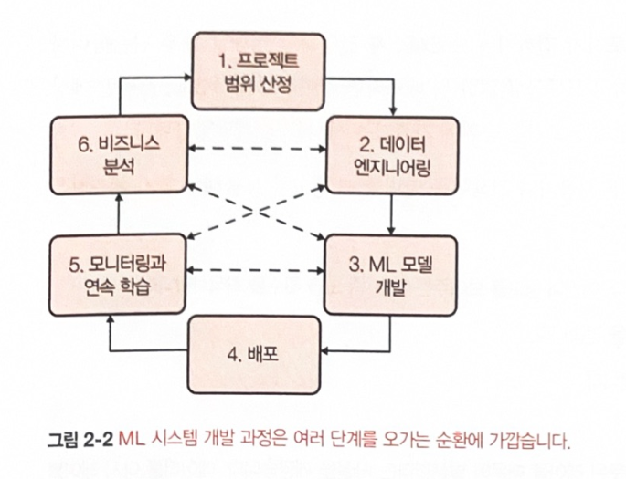
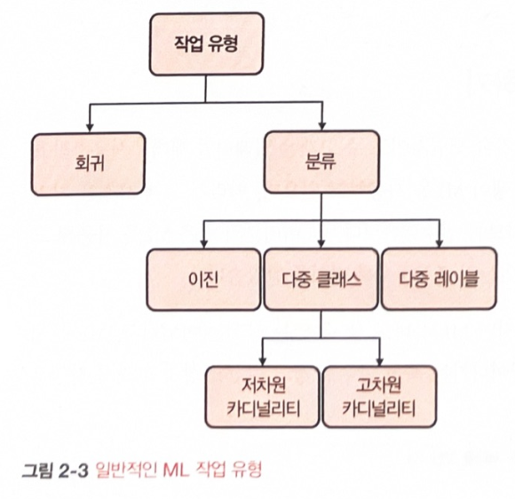

# [Ch02 머신러닝 시스템 설계 소개(Introduction to Machine Learning Systems Design)]  


## 2.1 비즈니스와 머신러닝의 목적
- 데이터 과학자는 ML 프로젝트를 진행할 때 성능지표(정확도, F1 점수, 추론 레이턴시...) 에 목적 및 관심  
- 기업은 ML 지표에 크게 관심 x  
기업 : 비즈니스 지표에 focus / 데이터 과학자 : ML 지표

- 오래 가지 못하는 ML 프로젝트는 비지니스 지표를 고려하지 않고 ML 조작에만 매달리고,   
관리자는 비지니스 지표에만 관심이 있어 ML 프로젝트로   
비지니스 지표를 끌어올릴 방법을 찾아내지 못해 프로젝트가 중단됨  

- 비즈니스에서 이뤄지는 모든 프로젝트의 궁극적인 목적은 직간접적으로 '이윤을 늘리는 것'
: 직접적으로는 매출(전환율)을 높이고 비용을 낮추며,
간접적으로는 고객 만족도를 높이고 체류 시간을 징가시키는 것임


- ML 이 비즈니스를 마술같이 변화시킬 수 있지만 하루아침에는 불가능함. 지속적인 투자 필요

- 프로덕션 환경에서 ml을 도입하고 성숙 단계에 이른 기업,
  약 5년이 넘은 기업 중 약 75%가 30일 이내에 신규 모델을 배포할 수 있고,
  막 ML 파이프라인을 도입하는 회사 중에서는 60%가 모델을 배포하는데 30일 이상이 걸림


## 2.2 머신러닝 시스템 요구 사항   
시스템의 신뢰성, 확장성, 유지보수성, 적응성 갖춰야 함   

#### <신뢰성>    

프로덕션 환경에서 오류가 발생해도 목표성능을 만족하면서 지속적을 기능 수행   

#### <확장성>    
ML 시스템은 다양한 방식으로 확장 가능(복잡도가 증가)     

- 자원 스케일링(resource scaling)   
    - 업 스케일링   
        규모가 증가할 때 사용하는 자원 확장(expanding)  
    - 다운 스케일링   
        자원이 필요하지 않을 때 사용하는 자원 축소(reducing)   

- Auto Scaling 사용량에 따라 머신 개수를 자동으로 확장하거나 축소, 구현하기 까다로움   

- 규모 증가를 처리하는 일에는 자원 확장뿐 아니라 아티팩트 관리도 포함   
    (모니터링과 재훈련 모드 자동화해야함)    

* 아티팩트(Artifact) : ML 개발 과정에서 생성되는 다양한 유형의 부산물   


#### <유지보수성>    
코드는 문서화하고 코드, 데이터 아티팩트는 버전을 관리해야함   

#### <적응성>   
ML 시스템 (50%:코드 50%:데이터)  유지보수성과 밀접하게 관련


## 2.3 반복프로세스

ML 시스템 개발은 반복적이며 대부분 끝이 없는 프로세스   
시스템을 프로덕션 환경에 배포하면 지속적으로 모니터링하고 업데이트   


Ex]
사용자가 검색어를 입력할 때 광고를 노출해야 할지 예측하는 ML 모델 개발   
1. 최적화할 지표 선택. -> 광고를 보여주는 횟수, 노출 횟수 최적화
2. 데이터 수집하고 레이블을 얻기
3. 피처 엔지니어링 작업
4. 모델 훈련
5. 오류 분석 중 오류가 잘못된 레이블 때문에 발생함을 알아, 데이터를 다시 라벨링함  
6. 모델 다시 훈련
7. 오류 분석 중에 모델이 항상 광고를 노출하지 말라고 예측한다는 사실을 알게 됨.   
 -> 보유한 데이터 중 99.99%에 음성(neagative) 라벨(광고에 노출하지 않음)이 있기 때문, 따라서 노출된 광고에 대해 더 많은 데이터를 수집해야 함
8. 모델 다시 훈련
9. 모델은 2개월된 테스트 데이터에는 잘 작동하지만 어제의 데이터에는 성능이 좋지 않음, 데이터를 최신으로 업데이트 해야함
10. 모델 다시 훈련
11. 모델 배포(deploy)
12. 모델이 잘 작동하지만, 실무자가 수익이 감소하는 이유를 묻고 있음. 광고를 노출하지만 클리하는 사람이 거의 없어서 모델을 변경해 노출 횟수 대신 클릭률을 최적화하고자함
13. 1단계로 돌아감




* ML 시스템 개발은 여러 단계를  오가는 순환에 가까움   
 프로젝트 범위 산정, 데이터 엔지니어링, ML 모델 개발, 배포, 모니터링과 연속 학습, 비즈니스 분석    


## 2.4 머신러닝 문제 구조화하기

- ML 문제는 입력과 출력, 학습 프로세스를 이끌어나가는 목적 함수로 정의   
- 지시 사항을 ML 문제로 구조화하는 것은 ML 엔지니어의 몫


#### [2.4.1 머신러닝 작업 유형]. 





- 머신러닝 작업 유형에서는 분류와 회귀가 있음   
  - 분류 모델은 입력을 여러 범주로 분류하고(이메일 스팸 유무 분류), 회귀 모델은 연속 값을 출력함 (특정 주택 가격 예측)   
- 회귀 모델은 분류 모델로, 분류 모델은 회귀 모델로 쉽게 바꾸어 구조화 할 수 있음   


- 이진 분류 vs 다중 클래스 분류   
    분류(classification) : 이진 분류(binary classification)와 다중 클래스 분류(multi-class classficiation)가 있는데,
    분류 문제는 분류할 클래스가 적을수록 단순함
    - 이진 분류는 분류 가능한 클래스가 2개로 이상거래탐지, 암 유/무 등이고 현업에서 흔히 보이는 문제임
    - 다중 클래스 분류는 클래스가 두 개보다 많을 때임

    - 클래스가 많으면 분류 작업의 '카디널리티가 고차원' 이라고 함
        카디널리티 : 데이터셋의 고유한 값의 개수

        예를 들어 질병 진단 문제의 질병 수와 제품 문제의 제품수는 수천에서 수만에 달하기도 하는데, 이렇게 카디널리티가 고차원 문제는 매우 까다롭다.   
        데이터를 수집해야하는데, 보통 ML 모델이 임의의 클래스로 분류하는 방법을 학습하려면 클래스당 데이터 포인트가 보통 '100개' 이상 필요하고,   
         클래스가 '1,000'개 이면 데이터 포인트가 10만개 이상이 필요함

    - 클래스가 많을 때는 '계층적 분류'가 유용한데,
    먼저 분류기가 각 데이터 포인트를 사우이 그룹 중 하나로 분류하고 다른 분류기가 데이터 포인트를 하위 그룹 중 하나로 분류하는 것이다.

        예를 들어, 각 제품을 전자 제품, 가정 및 주방 용품, 패션 용품, 반려동물 용품 등 네 가지 주요 범주로 분류하고, 한 제품을 패션 용품으로 분류했다면 다른 분류기로 하위 그룹인 신발, 셔츠, 청바지, 액세서리 중 하나로 분류한다.

- 다중 클래스 vs 다중 레이블 분류
    분류에서는 또 다중 클래스와 다중 레이블 분류가 있는데,
    이진 분류와 다중 클래스 분류에서 각 데이터 포인트는 정확히 '한 가지 클래스'에 속한다.
    한가지 관련 데이터 포인트가 여러 클래스에 속한다면 '다중레이블 분류' 이다.

    예를 들어, 기사를 네 가지 주제 기술, 연예, 금융, 정치로 분류하는 모델이라면 한 가지 기사가 기술과 금융 주제 양쪽에 포함될 수 있다.

    다중 레이블 분류 문제는 두 가지 주요 접근 법이 있는데
    (1) 다중 클래스 분류와 동일하게 처리하는 방법으로
    클래스가 [기술, 연예, 금융, 정치] 이고 데이터 포인트가 연예에 해당한다면 데이터 포인트 레이블을 벡터 [0,1,0,0]으로 표시한다.
    다중 레이블 분류에서 데이터 포인트가 양쪽인 연예, 금융에 해당하면 데이터 포인트 레이블을 [0,1,1,0] 으로 표시한다.
    (2) 두 번째 접근 법은 문제를 이진 분류 문제의 집합으로 바꾼다.
    기사 분류 모델의 네 가지 주제 각각에 해당하는 네 가지 모델이 있고, 각 모델이 기사 해당 주제에 속하는 지 여부를 출력한다.
    다중 레이블 문제는 기업에서 많이 직면하는 무제 유형 중하나인데, 다중 레이블 문제에서 데이터 포인트마다 속하는 클래스가 다를 수 있고, 레이블 다중성 문제가 증가해 레이블링 작업이 어려워짐
    어떤 데이터 어노테이터는 데이터 포인트가 두 가지 클래스에 속한다고 생각하는 반면, 다른 어노테이터는 데이터 포인트가 한 가지 클래스에만 속한다고 생각할 수 있음


## 2.4.2 목적 함수    
- ML 모델에는 학습 프로세스를 이끌어갈 목적 함수가 필요. 목적 함수 = 손실 함수(loss function).  
  학습 프로세스의 목적은 잘못된 예측으로 인한 손실을 최소화(최적화)하는 일   

- 지도 학습 ML에서는 손실을 계산할 때 모델 출력과 그라운드 트루스 레이블과 비교,
    평균 제곱근 오차(Root Mean Squared Error(RMSE)나 교차 엔트로피(cross entropy)같은 측정 값 사용  

- Ex]예를 들어, 위의 기사 분류 예제에서 기사가 기술, 연예, 금융, 정치 등 네 가지 주제로 분류된다고 할 때,   
    어떤 기사가 정치 클래스에 속한다고 할때, 그라운드 트루스 레이블은 [0,0,0,1] 이다.   
    모델이 이 기사에 대한 원시 확률 분포 [0.45, 0.2, 0.02, 0.33]을 출력했다면 모델의 교차 엔트로피 손실은 [0,0,0,1]에 대한 [0.45, 0.2, 0.02, 0.33]의 교차 엔트로피이다.   

    - 교차 엔트로피 계산
        ```
        import numpy as np

        def cross_entropy(p, q):
            return -sum([p[i]* np.log(q[i]) for i in range(len(p))])


        p = [0, 0, 0, 1]
        q = [0.45, 0.2, 0.02, 0.33]

        cross_entropy(p,q)
        ```
        resuslt
        ```
        1.1086626245216111 
        ```


- 의미 있는 목적 함수를 만들기 위해서는 대수학 지식이 필요함   
  보편적으로 회귀에는 평균 제곱근 오차(RMSE)나 평균 절대 오차(MAE), 이진 분류에는 로지스틱 손실(로그 손실), 다중 클래스 분류에는 교차 엔트로피를 사용.


- <목적함수 분리하기>
최소화할 목적 함수가 여러 개이면 ML 문제 구조화가 다소 까다로움.    
Ex] 사용자 뉴스 피드 항목의 순위를 지정하는 랭킹 시스템을 개발한다고 가정, 목표는 사용자 참여도 극대화    
시스템 목적을 다음 세 가지로 설정해 목표를 달성하고자 함   
  - 스패 필터링  
  - NSFW 콘텐츠 필터링  
  - 사용자 참여도(클릭할 확률)에 따른 게시물 랭킹   


사용자 참여도만 고려하면 윤리 문제가 발생할 수 있는데, 게시물 내용이 극단적일수록 사용자 참여도가 높은 경향이 있어서   알고리즘이 극단적인 콘텐츠에 우선순위를 준다.   
건전한 뉴스 피드를 만들고 싶다면 새로운 목표가 생기는데, 극단적인 견해와 잘못된 정보의 확산을 최소화하면서 사용자 참여도를 극대화하는 것이다.   
위의 목적에 더 추가되어,    


- 스팸 필터링   
- NSFW 콘텐츠 필터링   
- 잘못된 정보 필터링   
- 내용 품질에 따른 게시물 랭킹   
- 사용자 참여도(클릭할 확룰)에 따른 게시물 랭킹   


이제는 두 가지 목표가 상충하는데, 게시물 자체는 매력적이지만 내용의 품질이 의심스러울 때는 어떻게 해야 할까?    

- 시스템 목적은 목적함수로 표현해야 합니다. 품질을 기준으로 게시물 순위를 지정하려면 먼저 품질을 예측해야 하며 예측한 게시물 품질이 실제 품질에 가까울수록 좋음    
  따라서 각 게시물의 예측 품질과 실제 품질 간의 차이. 즉 quality_loss를 최소화.  

- 한 가지 접근 법은 두 손실을 하나로 결합하고 단일 모델을 훈련해 그 손실을 최소화하는 방법이다.   
  loss = a quality_loss + B engagement_loss.  

  a,b 값을 무작위로 테스트하면서 가장 잘 동작하는 값을 찾는데, 이를 체계적으로 조정하고 싶다면 '다목적 최적화(Multi-objective optimization)' 을 사용한다.   
  복수의 목적 함수를 동시에 최적화하는 수리 최적화 문제 해법이자 다중 기준의 의사 결정 접근법이다.   

  이 접근법은 a,b를 조정할 때마다 모델을 다시 훈련해야 한다.   
  예를 들어 사용자 뉴스 피드 품질은 올라갔지만 사용자 참여도가 내려가서 a를 낮츠고 b를 높이고 싶다면 모델을 다시 훈련 해야 한다.   

- 다른 접근법은 각각 한가지 손실을 최적화하는 서로 다른 모델 두 개를 훈련하는 방법   
  모델 1: quality_model: quality_loss를 최소화하고 각 게시물의 예측 품질 출력  
  모델 2: engagement_model : engagement_loss를 최소화하고 각 게시물의 예측 클릭수 출력   

    두 모델의 출력을 결합하고 결합한 점수를 게시물 순위로 지정

    a quality_score + B engagement_score    
    
    이렇게 되면 모델을 다시 훈련하지 않아도 a,b를 조정할 수 있음.   

- 목적 함수가 여러 개면 일반적으로 각각 분리 하는 편이 좋은데, 모델 개발과 유지 관리가 더 용이함.   


## 2.5 지성 vs. 데이터    

* 책 참고


## 2.6 정리    

- 어떤 프로젝트든 시작하기 전에 왜 프로젝트가 필요한지에 대한 고민이 필요함   
    ML 프로젝트도 마찬가지이며, 비즈니스 경영진은 대부분 ML 지표에 관심이 없음   
- 비즈니스용 ML 시스템을 개발한다면 비즈니스 목적에서 출발해야 한다.   
   그리고 비즈니스 목적을 ML 모델 개발의 이정표로 삼을 수 있게 ML 목적의 형태로 변환함   
- ML 시스템을 개발하기 앞서 좋은 시스템이 되려면 요구 사항을 충족해야 하는데,     
   요구 사항은 유스 케이스마다 다르지만 일반적인 신뢰성, 확장성, 유지보수성, 적응성은 충족해야함    
- ML 시스템 개발은 일회성 작업이 아니라 반복 프로세스임   