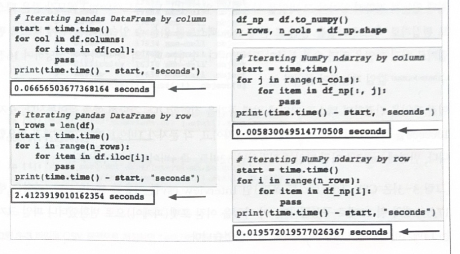

# [CH03 데이터 엔지니어링 기초(Data Engineering Fundamentals)]   

데이터 엔지니어링의 기본을 다룸    

- 일반적인 ML 프로젝트에서 사용하는 다양한 데이터 소스를 살펴보고 데이터 저장하는 포맷 알기     
- 데이터 저장은 추후 해당 데이터를 검색(retireval)할 경우 필요,     
  저장된 데이터를 검색하려면 데이터 포맷뿐 아니라 데이터가 어떻게 구조화됐는지 아는 것이 중요     
- 데이터 모델은 특정 데이터 포맷으로 저장된 데이터가 구조화되는 방식을 정의    

* 'searh'는 검색 엔진에서 키워드와 관련 있는 정보를 찾는 프로세스   
* 'retrieval'은 이미 데이터베이스나 스토리지에 저장되거나 색인된 정보를 액세스하는 프로세스   

- 데이터 모델이 실제 세계의 데이터를 표현하면, 데이터베이스는 데이터가 시스템에 저장되는 방식을 지정   
- 프로덕션에서는 일반적으로 데이터를 여러 프로세스 및 서비스에 걸쳐 처리   
  - ex] 피처 엔지니어링 서비스와 예측 서비스가 있다고 할 때,
    피처 엔지니어링 서비스는 원시 데이터에서 피처를 계산하고, 예측 서비스는 그 피처를 기반으로 예측값 생성   
    피처 엔지니어링 서비스에서 계산된 피처를 예측 서비스로 전달

- 프로세스 간 데이터를 전달하는 다양한 모든 존재,   
  - 데이터 스토리지 엔진을 사용하는 '과거 데이터'
  - 실시간 전송을 사용하는 '스트리밍 데이터'라느 두 가지 데이터 유형

- 각 유형의 데이터 처리는 '배치 처리' / '스트림 처리' 패러다임이 필요

## <3.1 데이터 소스>

- ML 시스템 다양한 소스에서 온 데이터로 작동,
  데이터마다 특성, 목적, 처리 방법이 다름. 데이터 소스를 파악하면 데이터를 보다 효율적으로 사용가능

- 대표적인 데이터 소스는 사용자가 명시적으로 입력하는 **사용자 입력 데이터(user input data)** 로 텍스트, 이미지, 비디오, 업로드된 파일.    
    - 이 경우, 사용자가 원격으로 잘못된 데이터를 입력할 수 있기에 포맷이 잘못되기 쉬움    
        텍스트가 너무 길거나 너무 짧을 수도, 수치(numerical value)가 필요한 부분에 사용자가 실수로 텍스트를 입력할 수도 있음   
        파일 얿로드 권한을 허용하면 사용자가 잘못된 포맷으로 파일을 업로드 할 수 있음   
        따라서 사용자 입력 데이터는 철저한 검사와 처리가 필요      

- 또 다른 소스는 **시스템 생성 데이터(system-generated data)**.   
  이 데이터는 시스템의 여러 구성요소에서 생성되며 구성 요소에는 다양한 로그와 모델 예측 같은 시스템 출력 등이 존재   

  - 로그는 시스템의 상태와 중요한 이벤트(메모리 사용량/인스턴스 수/호출된 서비스/사용된 패키지)를 기록하고,   
    데이터 처리 및 모델 훈련을 위한 대규모 배치 작업과 관련된 다양한 작업의 결과를 기록하는데,     
    '시스템이 어떠헥 작동하는지에 대한 가시성을 제공' 한다.(사고가 발생했을 떄 매우 중요)

- ML 시스템에서 로그 문제점
  -  ML 시스템을 디버깅하기 어려우므로 일반저긍로 가능한 것을 모두 기록 -> 로그 볼륨 증가
     -  신호에 잡음이 섞여 어디를 봐야할지 어려움
     -  급증하는 로그를 저장할 방법(유용할 떄만 저장하고 디벙깅 관련이 없어지면 삭제)

- 이 외에 회사의 서비스 및 엔터프라이즈 애플리케이션에서 생성된 내부 데이터베이스 로, 재고/고객 관계/자산 등을 관리하고,    
   ML 모델에서 직접 사용되거나 ML 시스템의 다양한 구성 요소에서 사용된다.

- + 다양한 **서드 파티 데이터**가 있다.   
    - 퍼스트 파티 데이터는 회사에서 사용자 또는 고객에 대해 이미 수집하고 있는 데이터   
    - 세컨드 파티 데이터는 다른 회사에서 자체 고객에 대해 수집하는 데이터로, 제공받으러면 비용 지불  

    - 서드 파티 데이터는  직접적인 고객이 아닌 공공 데이터 수집   
    (일반적으로 공급업체에서 정리 및 처리한 후 판매)

## <3.2 데이터 포맷>    

- 데이터는 일회성으로 사용하지 않는 이상 저장 필요. 기술 용어로는 데이터를 '지속(persist)'시킨다고 말함   
  데이터는 다양한 소스에서 가져오고 액세스 패턴도 다르므로 저장하기가 어렵고 비용 많이 듬     
- 따라서  데이터가 향후에 어떻게 사용될지 고려해 포맷을 선택해야 함  

고려해야핧 질문 몇가지   
- 멀티모달(multimodel) 데이터, 즉 이미지와 텍스트를 모두 포함하는 데이터는 어떻게 저장할 것인지?  
- 저렴하고 빠르게 액세스하려면 데이터를 어디에 저장해야 하는지?   
- 복잡한 모델을 다른 하드웨어에서 올바르게 로드하고 실행하려면 어떻게 저장해야 하는지?   

- **데이터 직렬화(data serialization)**는 데이터 구조나 객체 상태를 저장 혹은 전송하고 나중에 재구성할 수 있는 포맷으로 변환하는 프로세스.   
  직렬화 포맷은 매우 다양   
  - 사람이 읽을 수 있는지(human readability), 텍스트인지 이진(binary)인지 등 다양한 특성 고려   
  - 데이터 직렬화 포맷(JSON,CSV,파케이,Avro, Protobuf,pickle) 등 존재   

### <3.2.1 JSON>    

- JSON(JavaScript Object Notation), 자바스크립트에서 파생됐지만 언어 독립적   
- 사람이 읽을 수 있으며 키-값(key-value)쌍 패러다임  정형 포맷   
- JSON 파일은 텍스트 파일이므로 저장 공간을 많이 차지

### <3.2.2 행 우선 포맷 vs. 열 우선 포맷>    

CSV(comma-separated values)와 파케이의 비교

+ CSV는 행 우선으로, 행의 연속 요소가 메모리에 나란히 저장되고, 파케이는 열 우선으로 열의 연속 요소가 메모리에 나란히 저장   

예를 들어, 데이터셋에 샘플 1,000개가 있고, 각 샘플이 feature를 10개를 가지고 있을 때에   
CSV 같은 행 우선 포맷은 샘플에 액세스(오늘 수집된 모든 샘플 액세스),    
파케이 같은 열 중심 포맷은 featue에 액세스(모든 샘플의 타임스탬프에 액세스) 하는 것이 좋음.   

+ 열 우선 포맷을 사용하면, 데이터가 수천개의 피처로 대용량일 때 더욱 효율적임   
  
  예를 들어 승차 공유(ride-sharing) 트랜잭션 데이터에 피처 1000개가 있고    
  우리는 그 중 시간, 위치, 거리, 가격 등 네 가지 피처만 원할 때,    
  열 우선 포맷을 사용하면 각 치퍼에 해당하는 열 네 개를 직접 읽음   
  반면에 행 우선 포맷을 사용하면 행의 크기를 모르는 경우 모든 열을 읽은 다음 네 열로 필터링해야 함.  
  행 크기를 안다고 해도 캐싱을 활용할 수 없고 메모리 안에서 이동해야 하므로 여전히 느림   

- But, 행 우선 포맷을 사용하면 더 빠른 데이터 쓰기가 가능한데, 데이터에 새로운 예제를 계속 추가해야하는 상황이면,   
  행 우선 포맷 파일에 쓰는 편이 빠름   

- Generally, 쓰기를 많이 수행하면 행 우선 포맷( ex)csv), 읽기를 많이 수앵하면 열 우선 포맷이 낫다.   

|**넘파이(Numpy)와 판다스(Pandas)**

- 판다스(Pandas)는 열 포맷 중심
  판다스는 '데이터프레임(DataFrame)'을 기반으로 구축 됐고, 행과 열이 있는 2차원 테이블이다.   
  넘파이는 행 우선인지 열 우선인지 지정할 수 있으며, ndarray가 생성될때 순서를 지정하지 않으면 기본적으로 행 우선이 된다.

왼쪽 그림 데이터프레임에 행별로 액세스하면 열별로 엑세스할때보다 느림   

이 데이터프레임을 넘파이 ndarray로 변환하면 오른쪽 그림과 같이 행에 엑세스하는 속도가 훨씬 빨라짐   

