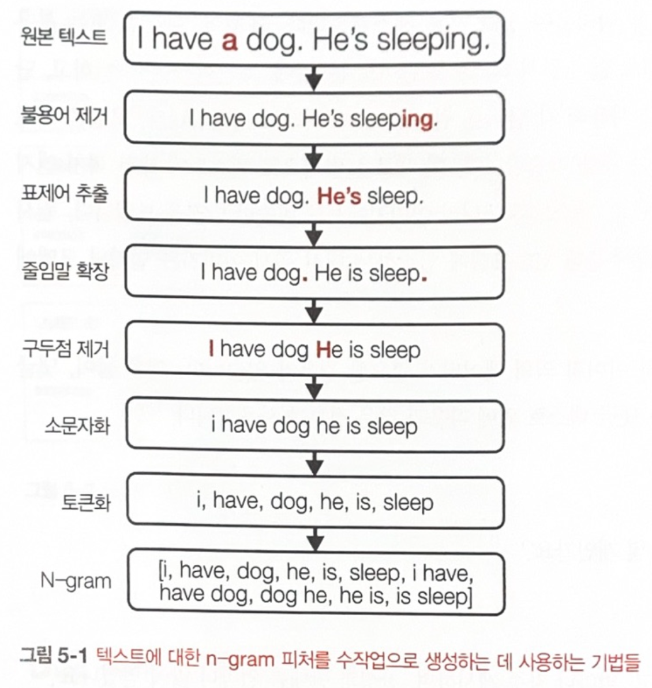

# CH05 Feature Engineering

- 올바른 피처를 보유하는 것은 ML 모델을 개발하는데 중요함
- 실행가능한 모델이 있는 한 올바른 피처를 보유하는 것이 하이퍼파라미터 조정 같은 알고리즘 기법보다 큰 향상을 이끌어낼 수도 있음


## <5.1 학습된 피처 vs 엔지니어링된 피처>

- 딥러닝을 수행하면 피처 엔지니어링이 필요 엔지니어링이 필요 업시도 함.    
  딥러닝의 장점은 피처를 수작업으로 만들 필요가 없어서, 딥러닝의 치퍼 학습이라고도 함     
- 많은 피처들이 알고리즘에 의해 자동으로 학습되고 추출되지만, 모든 피처를 자동화하려면 아직 멀었음   
- 프로덕션용 ML 애플리케인션의 대부분은 딥러닝이 아니기도 함    
  
  for example, 댓글의 스팸 여부를 분류하기 위해 감성 분류기를 구축한다고 가정할 떄, 딥러닝 이전에는   
  텍스트 조각이 주어졌을 때 '표제어 추출(Lemmatization)', '줄임말 확장(expanding contraction)',   
  '구두점(punctuation) 제거', '소문자화(lowercasing)' 와 같은 고전적인 텍스트 처리 기술을   
  수동으로 적용하고,텍스트를 n-gram으로 분할함    


- n-gram은 주어진 텍스트 샘플 내 항목 n개의 연속 시퀀스임    
  항목은 '음소(phoneme)', '음절(syllable)', 문자 또는 단어임   
  예를 들어, 'I like food' 라는 게시물이 주어지면 단어 레벨 1-gram은 ['I', 'like', 'food'],   
  단어 레벨 2-gram은 ['I like', 'like food'] 이다.   
  n이 1과 2 일때 이 문장의 n-gram 피처 집합은 ['I', 'like','food', 'I like', 'like food'] 이다.   


  텍스트에 대한 n-gram 피처를 수작업으로 생성하는 텍스트 처리 기법은   
  (1) 원본 텍스트 -> (2) 불용어 제거 -> (3) 표제어 추출 -> (4) 줄임말 확장   
  -> (5) 구두점 제거 -> (6) 소문화 -> (7) 토큰화 -> (8) N-gram   

  훈련 데이터에 대한 n-gram을 생성한 뒤에는 각 n-gram을 인덱스에 매핑하는 어휘(vocabulary)를 생성하여,   
  n-gram의 인덱스 기반으로 벡토로 변환함.    

  n-gram의 어휘가 7이면 각 게시물은 요소 7개로 구성된 벡터가 되며,    
  각 요소는 해당 인덱스의 n-gram이 게시물에 나타나는 횟수에 해당함    

  I->0, like->1, good->2, food->3, I like 4 ->, good food->5, like food->6    
  'I like food'는 벡터 [1,1,0,1,1,0,1] 로 인코딩 됨    

  피처 엔지니어링에는 도메입녈 기술에 대한 지식이 필요함.
  도메인은 자연어 처리이고, 텍스트 언어는 영어임

- 피처 엔지니어링은 프로세스는 반복적인 경향이 있어, 따라서 취약할 수 있음.   

- 위에 있는 자연어처리 시 표제어, 구두점 또는 불용어(stopword) 제거를 신경 쓸 필요 없이 원시 텍스트를 단어로 분할(토큰화: tokenization)하고,    
  단어로 어휘를 만들고 이를 사용개 각 단어를 원-핫 벡터로 변환하여, 모델이 이러부터 유용한 피처를 추출하는 것을 학습함    


- ML 시스템에 텍스트와 이미지 외의 데이터가 필요한 경우가 있는데, 예뜰 들면 댓글의 스팸 여부를 감지 할 때는     
  댓글 텍스트 왜에 댓글의 수(찬성과 반대가 각각 몇 개 인지),  
  댓글을 게시한 사용자(계정이 언제 생성됐고 얼마나 자주 게시하면 찬성과 반대를 얼마나 많이 얻었는지),     
  댓글이 게시된 스레드(조회수가 몇인지, 인기 있는 스레들일수록 스팸성 댓글이 많은 경향이 있음)    


- 피처 엔지니어링은 사용할 정보를 선택하고 이 정보를 ML 모델에서 사용하는 포맷으로 추출하는 프로세스임   


## <5.2 피처 엔지니어링 기법>   

- 데이터의 피처를 전처리 할때 고려할 중요한 작업은   
  결측값(missing value) 처리, 스케일링(scaling), 이산화(discretization),    
  범주형(categorical) 피처 인코딩, 교차(cross) 피처와 위치(positional) 피처 생성 등이 있음     


##### [결측값 처리]

- 결측값에는 세가지 유형
  - (1) 비무작위결측(MNAR, Missing not at random): 결측값이 발생한 이유가 실제 값 자체에 있음   
    for exmaple, 일부 응답자가 소득을 공개하지 않았을 때, 소득을 신고하지 않은 응답자가 소득을 신고한   
    응답자보다 소득이 더 높은 경향이 있다고 판명 될 수 있는 것처럼, 소득 값이 누락된 이유는 '값 자체와 관련됨'  

  - (2) 무작위결측(MAR, Missing at Random): 결측값이 발생한 이유가 값 자체가 아닌 다른 관측 변수에 있음    

    예시에서 성별이 'A'인 응답자가의 연령 값이 누락된 경우가 있는데, 설문 조사에서 성별이 'A'인 응답자가   
    연령 공개를 원하지 않아서 일 수도 있음    


  - (3) 완전 무작위 결측(MCAR, Missing completey at random): 결측값에 패턴이 없음   
    for example, '직업' 열의 결측값은 값이나 다른 변수들 때문이 아니라 완전 무작위임.    
    사람들은 때때로 특별한 이유 없이 값을 채우는 것을 잃어버리는데,  
    이러한 결측은 매우 드물며 보통 값이 누락되는 데는 이유가 있어 조사가 필요함.    

- 결측값은 특정 값으로 채우거나(대치), 제거(삭제)해 처리함    


##### [결측값 삭제(Deletion)]

- 결측값 처리에서 삭제는 '열 삭제'와 '행 삭제' 방법이 있음.  

- 행 삭제는 누락된 값(들)이 있는 샘플을 제거함.  
  : 이 방법은 결측값이 완전 무작위(MCAR) 이며, 결측값 있는 샘플의 비주이 적을 때(예를 들어 0.1%) 유용함.   
  (데이터 샘플의 10%를 제거할 수 없으므로).   

  데이터 행을 제거하면, 결측값이 비무작위(MNAR)의 경우, 모델이 수행하는데  필요한 중요한 정보고 제거될 수 있음    
  데이터 행을 제거하면 결측값이 무작위(MAR)인 경우 모델에 편향이 발생할 수 있음    


##### [결측값 대치(Imputastion)].   

- 데이터 삭제가 더 쉽긴 하지만 중요한 정보가 손실되고 모델에 편향이 발생할 수 있는 단점이 있으므로,   
  결측값을 삭제하는 대신 특정 값으로 채우는 방법이 있음.   

- 결측값을 대치할 때는 일반적으로 기본값으로 채움
  예를 들어, 작업이 누락된 경우 빈 문자열 ''로 채우거나, 결측값을 평균 mean, 중앙값 median,  
  최빈값 mode 로 채우는 일밙거인 방법도 있음    

- 결측값 삭제와 대치 모두 많은 경우에 잘 작동하지만 문제가 있는 사용자 경험을 유발할 수 도 있음

- 일반적으로 결측값을 가능한 값으로 채우지 않는 편이 좋음
  예를 들어 자녀 수 피처의 결측값을 0으로 채우지 않는 것이 좋은데, 값이 0일수도 있기 때문임.   
  결측값을 0으로 채우면 정보가 없는 사람과 자녀가 없는 사람을 구분하기가 어려워짐    

- 특정 데이터셋에 대한 결측값을 처리하기 위해 여러 기법을 동시에 또는 순서대로 사용할 수 있음   
  

- 결측값을 삭제하면 중요한 정보를 잃거나 편향이 강조될 위험이 있고,    
  결측값 대치를 사용하면 데이터에 자신의 편향을 중립하고 데이터에 잡음을 더할 수 있음.    
  심한 경우 데이터 누수 위험이 있음    


##### [스케일링]     

- 예를 들어 12개월 내 주택 구매 여부를 예측하는 작업을 진행할 때, 데이터 연령 변수는 20-40 인 반면,    
  연간 소득 변수는 10,000-150,000 사이임. 두 변수를 ML 모델에 입력하면 모델은 150,000와 40이    
  서로 다른 것을 나타낸 다는 사실을 이해하지 못함    
- 모델이 피처를 입력하기 전에 각 피처를 유사한 범위로 스케일링 하는 것이 중요함 => 피처 스케일링
- 적은 노력으로 모델 성능 향샹을 이끌어 낼 수 있고, 이 작업을 하지 않으면 모델이 이상한 예측을 할 수 있음    
  (그래디언트 부스트 트리나 로지스틱 회구 같은 경우)

- 직관적으로 피처를 스케일링 하려면 [0,1] 범위로 조절함    
  변수 x가 주어졌을 때, 공식적으로 변수 값이 [0,1] 범위에 있도록 조절함    


x' = x-min(x) / max(x) -min(x)    
x가 최대값이면 스케일링된 값 x'가 1이고 x가 최소값이면 스케일링된 값 x'는 0   
피처의 임의의 범위 [a,b]에 있도록 하려면 다음의 공식을 사용하는데 [-1, 1] 범위가 [0,1] 범위보다 더 잘 동작함   

```
x' = a + (x-min(x))(b-a) / max(x) - min(x)
```

- 임의의 범위로 스케일링 하는 것은 변수에 대해 아무런 분포 가정을 하지 않을 때도 효과적임    

- 변수가 정규 분표를 따른다고 생각하면 평균고 단위 분산 (unit varinacE)가 0이 되도록 정규화하면 됨   
  => 표준화(standardzation)    
  x' = x-x bar / σ   

- 실제로 ML 모델은 비대칭 분포를 따르는 피처로 어려움을 겪는 경향이 있음    
  왜곡을 완화하는 기법으로 피처에 '로그 변환(log transformation)'을 적용함 => 데이터 왜곡을 줄임   
  로그 변환으로 성능이 향상될 때가 많지만 모든 경우에 작동하지는 않음    
  실젯값이 아닌 로그 변환된 피처 값으로 분석하지 않도록 주의해야함     


- 스케일링은 데이터 누수의 원인이 될 수 있고, 전역 통계치가 필요한 경우가 많음.    
  최소, 최대 또는 평균을 계산하려면 전체 훈련 데이터 또는 부분 집합을 확인해야 함     
  => 추론하는 동안 훈련 중에 얻은 통계치를 재사용해 신규 데이터를 스케일링할 수 있는데,     
  신규 데이터가 훈련 데이터의 통게에서 크게 변경됐다면 훈련 데이터 통계는 유용하지 않기 때문에     
  모델을 자주 재훈련하는 것이 중요함     


##### [이산화]    

- 실제로 이산화가 도움이 되는 경우는 거의 없음    

- 이산화는 연속형 피처를 불연속형 피처로 바꾸는 과정임    

- 양자화(quantization) 또는 비닝(binning)이라고 하며, 주어진 값에 대한 버킷을 생성함    

- 양자화를 적용하면 모델은 무한한 범주에 대해 훈련할 필요 없이 훨씬 훈련하기 쉬운 범주로 훈련하는데 집중할 수 있고,   
  이 기법은 훈련 데이터가 제한된 경우에 더 유용함   


- 이산화는 연속형 피처 뿐 아니라 이산현 피처에도 적용이 가능함   

- 단점은 범주 분류가 범주 경계에서 불연속성을 발생시킨다는 것임    
  예를 들어, $100,000는 $35,000와 동일하게 처리되는 반면,   
  훨씬 가까운 값인 $34,999는 완전히 다른 값으로 처리됨     

- 범주의 경계를 선택하기는 쉽지 않은데, 변숫값의 히스토그램을 확인하고 적절한 경계를 선택해야 일반적으로 상식,    
  기본 분위수, 주제 전문 지식이여도 도움이 됨


##### [범주형 피처 인코딩]    

- 프로덕션 데이터 경험이 없는 사람들은 범주가 '정적'이라고 가정하는 경향이 있는데,     
  실제로 많은 범주는 '정적'이긴 함   
  예를 들어, 연령 버킷과 소득 버킷은 거의 변하지 않고 범주가 정확히 몇 개 인지 미리 알고 있어   
  이러한 범주는 각각의 번호만 부여하면 됨   

- 그러나 프로덕션에서는 범주가 변화함    
  사용자가 아마존에서 구매할 제품을 예측하는 추천 시스템을 구축한다고 가정했을 때,     
  '제품 브랜드' 피처는 아마존에서 2019년에 이미 200만개를 넘겼음    

  브랜드가 압도적으로 많지만, 각 브랜드를 숫자로 인코딩하면 200만 개 브랜드   
  각각이 0부터 1,999,999까지 200만 개 수치로 변환됨    
  모델은 과거 테스트 세트에서 매우 잘 수행되기에, 현재 트래픽의 1%에서 테스트하도록 승인됐다고 가정을 함  
  하지만 프로덕션에서는 모델이 문제를 일으키게 되는데, 본 적이 없는 브랜드를 발견하면 인코딩을 할 수 없게 됨 
  프로덕션에서는 지속적으로 신규 브랜드가 입점하기 때문에, 이 문제를 해결하기 위해서는 2,000,000인   
  UNKNOWN 범주로 새 브랜드를 할당해야 함   
  그러나, 모델이 훈련 세트에서 UNKNOWN 카테고리를 보지 못했으므로   
  UNKNOWN 브랜드 제품을 추천하지 않게 됨    
  => 이 경우, 가장 인기 있는 상위 99% 브랜드만 인코딩하고 하위 1% 브랜드를 UNKNOWN으로 인코딩함    
  약 1시간은 모델이 제대로 작동하지만, 제품 추천에 대한 클릭률이 곤두박질 침    
  => 1시간 동안 신규 브랜드 20개가 입점함    
  일부는 신규 명품 브랜드이고 일부는 모조고 일부는 기성 브랜드임    
  그러나, 모델은 모두 훈련 데이터에서 인기가 없는 브랜드와 동일하게 취급함   


- 위와 같은 상황은 여러 사례에서 많이 발생함    
  예를 들어, 댓글의 스팸 여부를 예측하는 사례에서 댓글을 게시한 계정을 피처로 사용할 수 있는데,     
  신규 계정은 계속해서 생성되고 신규 제품 유형, 신규 웹사이트 도메인, 신규 IP 주소 등 마찬가지이다.    
  모두 신규 범주가 추가될 때 발생하기 시작함     

  => 위의 문제를 해결하는 방법은 의외로 찾기 어려움    
  신규 범주에 적절한 버킷을 할당하는 것이 어렵기 때문임     

- 한 가지 해결책은 마이크로소프트에서 개발한 VOWPAL Wabbit 패키지에 의해    
  대중화된 해싱(hashing) 트릭
  해시 함수를 이용해 각 범주이의 해시 값을 생성하고,
  해시 값은 해당 범주의 인덱스가 됨
  해시 공간을 지정할 수 있어 범주가 몇 개인지 알 필요 없이 피처에 대한 인코딩 값을 미리 고정할 수 있다.   

```
예를 들어, 18비트 해시 공간을 선택하면 가능한 해시 값은 262,144(2^18)
```
=> 모든 범주는 0과 262,143 사이 인덱스로 인코딩되고, 모델이 이전에 본 적 없는 범주까지 포함됨.   

그러나, 해시 함수의 문제는 '충돌' 로, 두 범주에 동일한 인덱스가 할당됨.    
많은 해시 함수에서 충돌이 무작위로 일어남


위의 예시에서 신규 브랜드는 기존 브랜드와 인덱스를 공유할 수 도 있음.   
그러나 UNKNOWN 범주를 사용할 때 처럼 항상 비인기 브랜드의 인덱스에 할당되는 이른 발생하지 않음.  


피처가 충돌해도 영향이 크지는 않긴 한데, 부킹닷컴 연구에서 피처 중 50%가 충돌해도    
로그 손실이 0.5% 미만으로만 증가한다고 함.       
=> 충돌을 줄이기 위해 충분히 큰 해시 공간을 선택할 수 있는데,     
정석적인 방법이 아니라서 ML 커리큘럼에서 제외함.   

그러나, 이 방법은 프로덕션에서 들어오는 데이터 포인트로 학습하는 연속 학습에 특히 유용함.    


##### [피처 교차]    

- 피처 교차는 둘 이상의 피처를 결합에 새로운 피처를 생성하는 기법   

- 피처 간의 비선형 관계를 모델링 하는데 유용함         
  예를 들어, 향후 12개월 내 주택 구매 여부를 예측하는 작업을 가정한다면,    
  혼인 상태와 자녀 수 사이에 비선형 관계가 있다고 의심되므로     
  '혼인 상태 및 자녀 수' 라는 신규 피처를 생성함    

- 피처 교차는 변수 간의 비선형 관계를 모델링 하는데 유용함    


- 신경망에서는 비교적 덜 중요하지만 선형 회귀, 로지스틱 회귀와 같이 비선형 관계를    
  학습할 수 없는 모델에 필수  


- 명시적 피처 교차가 신경망에서 비선형 관계를 더 빠르게 학습하는데 도움이 됨     
  => DeepFM과 xDeepFM은 추천시스템 및 클릭률 예측을 위한 명시적 피처 상호 작용을     
  성공적으로 활용한 모델군임     


- 피처 교차 기법을 사용할 때 주의점은 피처 공간이 폭발할 수 있다는 점임     
  피처 A와 B에 각각 100가지 값이 있다고 가정했을 때,     
  두 피처를 교차하면 1만 가지(100X100=10,000)인 피처가 생성됨    
  모델이 가능한 피처 값 모두를 학습하도록 하려면 훨씬 더 많은 데이터가 필요함     


  또한, 과적합을 조심해야 하는데 피처 교차로 인해 모델이 사용하는 피처 수가 증가해    
  모델이 훈련 데이터에 과적합 될 수 있음     


##### [이산 및 연속 위치 임베딩]     


- 위치 임베딩(positional embedding)은 컴퓨터 비전과 nlp 분야의     
  많은 애플리케이션에서 표준 데이터 엔지니어링 기술로 자리 잡음     


***임베딩***    

- 데이터 하나하나를 나타내는 벡터    
  어떤 데이터 유형에 대해 동일한 알고리즘으로 생성한 모든 가능한 임베딩 세트를   
  '임베딩 공간' 이라고 하고, 동일 공간에 있는 임베딩 벡터는 모두 크기가 동일함    

- 임베딩은 각 단어를 벡터로 나타내는 단어 임베딩에 흔히 사용되고,    
  다른 데이터 유형에 대한 임베딩도 점점 인기를 끌고 있다.    
  다른 데이터 유형의 임베딩은 전자 상거래 솔루션 product 임베딩,     
  핀터레스트의 이미지/그래프/쿼리/사용자 임베딩 등이 있다.    


- 언어 모델링 작업을 예로 들자면, 이전의 토큰 시퀀스를 기반으로    
  다음 토큰(단어나 문자 및 하위 단어)를 예측한다.    

  for example, 'Sometimes all I really want to do is.'같은 단어 8개짜리  
  시퀀스가 임의로 줘어졌을 때, 다음 단어를 예측하려고 할 때    
  임베딩에 순환 신경망을 사용하면 단어가 순차적으로 처리되어, 단어 순서가 암시적으로 입력됨   

  그러나, 트랜스포머 같은 모델을 사용하면 단어가 병렬처리 되므로 모델이 순서를 알 수 있도록 단어 위치를   
  명시적으로 입력해야 함    
  모델에 절대 위치를 입력값으로 사용하면, 신경망은 단위 분산(unit variance)를 갖지 않는 입력값음   
  잘 작동하지 않는다.    
  위치를 0과 1사이로 리스케일링해 0,1,2,...7인 것을 0, 0.143, 0.286, .. 1로 둔다면 두 위치간   
  사이가 너무 작아 신경망이 이를 구별하는 법을 학습하기 어려워짐   

- 위치 임베딩을 적용하는 방법은 단어 임베딩처럼 처리하는 것으로, 단어 임베딩에서는 임베딩 행렬을 사용하는 데,   
  열 개수는 어취 크기고 각 열은 해당 열의 인덱스에 잇는 단어의 임베딩이다.    
  위치 임베딩에서 열 개수는 위치 개수로, 위치 임베딩 차원은 일반적으로 단어 임베딩 차원과 동일해    
  둘이 합산이 가능하다.    

- 위치 임베딩 값이 고정되는 경우도 있긴한데, 각 위치에 대한 임베딩은 요소(element) S개를 포함하는 벡터는   
  (S:위치 임베딩 차원) 각 요소는 일반적으로 사인, 코사인 함수로 미리 정의됨 프랜스포머 논문에서는 각 요소가   
  짝수 인덱스에 있으면 sin함수, 그렇지 않으면 cosine함수를 사용함    

  => 고정 위치 임베딩은 ***푸리에 피처***로 알려진 방식의 특수 경우임   
  위치 임베딩의 위치가 연속적이면 푸리에 피처도 연속적이다.    

  for example, 찻주전자 같은 3D개체를 표현한다고 가정할 때 찻주전자 표면의 각 위치는 연속적인 3차원 좌표로 표시된다.    
  위치가 연속적일 때 연속 열 인덱스로 임베딩 행렬을 구축하기에는 매우 어려우나 사인 및 코사인 함수를    
  고정하는 위치 임베딩은 유용함   

  푸리에 피처는 좌표(또는 위치)를 입력으로 사용하는 작업에서 모델 성능을 향사하는 것으로 나타났다.   


### <5.3 데이터 누수>    

- 데이터 누수(data leakage)는 훈련 데이터셋의 피처 집합으로 레이블 정보가 누수되는 현상으로,   
  추론 시에 사용하는 입력데이터에는 그 정보가 존재하지 않는 경우임

- 데이터 누스는 분명하지 않는 경우가 많아 대처하기 까다로움   

##### 데이터 누수의 일반적인 원인   

(1) 시간 대신 무작위로 시간적 상관 데이터를 분할한 경우   
  - 미래 정보가 훈련 과정에 유출돼 모델이 평가 중 부정행위를 하는 것을 방지하려면 가능한 데이터를    
    무작위로 분할하는 대신 시간별로 분할해야함   

    예를 들어 5주 분량의 데이터가 있다면, 처음 4주간의 데이터를 훈련 분할에 사용한 뒤 5주차 데이터를   
    무작위로 검증 및 테스트 분할로 분할함

(2) 분할 전 스케일링을 수행한 경우   

- 스케일링에는 데이터평균, 전역 통계치가 필요한데 흔히 하는 실수가 전체 훈련 데이터로 전역 통계치를    
  생서안 뒤에 분할하는 것임

- 테스트 샘플의 평균과 분산이 훈련 프로세스에 유출되고, 테스트 샘플에 대한 예측 스케일링 하게 됨    
  프로덕션에서는 사용할 수 없으므로 모델 성능이 저하됨   

- 이러한 누수를 방지하기 위해, 스케일링 전에 먼저 데이터를 분할하고 훈련 분할 통계치를 사용해 모든    
  분할을 스케일링해야 함   

- 어떤 측면에서는 탐색적 데이터 분석(eda)와 데이터 전처리 전에 데이터를 분할해 테스트 분할에 대한   
  정보를 실수로 얻는 일을 방지하라고 제안함    


(3) 테스트 분할의 통계치로 결측값을 채운 경우    

- 피처의 결측값을 처리하는 한 가지 방법은 모든 값의 평균 및 중앙값으로 입력값을 채우는 것인데,   
  훈련 분할이 아닌 전체 데이터로 평균 또는 중앙값을 계산하면 데이터 누수가 발생함   

- 이 유형은 스케일링으로 인한 누수와 유사해, 방지하려면 모든 분할의 결측값을 채울 때 훈련 분할의 통계치만 사용해야함   


(4) 분할 전 데이터 중복을 제대로 처리하지 않는 경우    

- 데이터에 중복 또는 거의 중복되는 데이터가 포함되어 있을 때, 분할 전에 이를 제거하지 않으면 동일한   
  샘플이 훈련, 검증, 테스트 분할에 모두 나타나게 됨    

- 데이터 중복은 산업계에서 매우 흔하고 유명한 연구 데이터셋에도 발견됨   

- 데이터 중복은 데이터 수집 또는 서로 다른 데이터 소스들의 병합으로 인해 발생함   

- 또한, 데이터 중복은 데이터 전처리 떄문에 발생하기도 하는데, 오버샘플링으로 인한 특정 샘플이 중복될 수 있음   

- 이를 방지할려면 분할 전/후 데이터 중복 여부를 항상 확인해야함. 데이터를 오버샘플링 하려면 분할 전이 아닌, 분할 후에 수행해야 함   


(5) 그룹 누수

- 강한 레이블 상관관계를 갖는 데이터 포인트들(그룹)이 다른 분할로 나뉘어 들어가는 경우임   
  for example, 환자가 일주일 간격으로 폐CT를 두 번 촬영했다고 가정할 때, 두 스캔 값은 페암 징후 여부에   
  대한 레이블이 동일하지만 하나는 훈련 분할에 있고 하나는 테스트 분할에 있음. 이러한 유형의 누수는   
  동일한 물체를 몇 밀리초 간격으로 찍은 사진이 포함된 객체 탐지 작업에 흔히 나타남    

  이러한 누수는 데이터가 어떻게 생성됐는지 이해하지  않고는 피하기 어려움   

(6) 데이터 생성 과정에서의 누수

- for example, CT 스캔상 폐암 징후 정보가 스캔 장비를 통해 누출되는 예시로, 데이터 생성과정에서 누수가 생기는 경우

- 이러한 누수를 확실히 피할 방법은 없지만 데이터 소스를 추적하고 데이터가 수집 및 처리되는 방법을 이해하면서 위험을 줄일 수 있음   

- 데이터를 정규화해 소스가 서로 다른 데이터기리 평균과 분산이 같아지도록 함   


###### 데이터 누수 검출    

- 데이터 누수는 데이터 생성, 수집, 샘플링, 분할, 처리에서 피처 앤지니어링에 이르기까지 여러 단계에서 발생함   

- ML 프로젝트의 전체 수명 주기 동안 데이터 누수를 모니터링하는 것이 중요    


- 타깃 변수(레이블)에 대한 각 피처 또는 피처 집합의 에측 검정력을 측정함    
  피처의 상관관계가 비정상적으로 높다면 해당 피처가 생성되는 방식과 상관관계가 적절한지 조사해야 함     
  => 두 피처가 독립적으로 데이터 누수를 포함하지는 않아도 함께는 포함할 수 있음    


  for example, 회사 직원 근속 기간을 예측하는 모델을 구축한다고 가정하면 시작 날짜와 종료 날짜를 각각    
  사용하면 근속 기간에 대한 많은 정보를 얻을 수 없지만 두 날짜를 함께 사용하면 근속 기간에 대한 정보를    
  얻게 됨   


- 피처 또는 피처 집합이 모델에 얼마나 중요한지 측정하려면 '절제 연구'를 수행함   
  피처 제거 시 모델 성능이 크게 저하된다면 해당 피처가 왜 중요한지를 조사함.  피처가 수천 개에 달할    
  정도로 방대하면 가능한 조합에 모두 절제 연구를 수행하기에는 불가능하지만, 가장 의심이 되는 피처의   
  하위 집합으로나 수행해도 유용함   

  절제 연구는 오프라인으로, 즉 로컬 환경에서 수행할 수 있어 다운타임 동안 시스템에서 절제 연구를   
  수행할 수 있음   

- 또한 모델에 새롭게 추가한 피처를 주시함. 신규 피처를 추가했을 때 모델 성능이 크게 향상되면 피처가 정말  
  좋거나 해당 피처에 레이블에 대한 유출된 정보가 포함된 것임   

- 테스트 분할은 신규 피처에 대한 아이디어를 내거나, 하이퍼파라미터 조정(tunint)을 위해 최종 성능을    
  산출하는 것 이외의 수단으로 사용하면 미래 정보가 룬현 프로세스로 누출될 위험이 있음   


#### <5.4 좋은 피처를 설계하는 방법>    

- 일반적으로 피처를 추가하면 모델 성능이 향상됨   

- 그러나 프로덕션 중인 모델에 사용되는 피처들은 시간에 따라 늘어나고, 피처가 더 많다고 해서 항샹 모델   
  성능이 좋은 것이 아님   
  오히려 너무 많으면 모델 훈련과 서빙에 좋지 않음   


  - 피처가 많을수록 데이터 누수 가능성 높음
  - 피처가 너무 많으면 과적합 라생
  - 피처가 너무 많으면 모델을 제공하는 데 필요한 메모리 증가,
    결과적으로 모델을 제공하기 위해 더 비싼 머신 및 인스턴스 사용
  - 피처가 너무 많으면 온라인 예측을 수행할 때 추론 레이턴시가 증가함
  - 쓸모없는 피처는 기술 부채(technical debt)가 됨
데이터 파이프라인이 변경될 때는 영향을 받는 피처 전체가 조정되어야 함


- 이론적으로 특정 피처가 모델의 정확한 예측에 도움이 되지 않는 경우나 L1 정규화가 해당 피처의 계수를   
  0으로 만들어 제거해주지만 실제로는 그렇게 깔끔하게 되지 않음    

- 더 이상 유용하지 않은 피처를 수동으로 제거해 좋은 피처를 우선적으로 처리하면 모델이 더 빨리 학습하는데
  도움이 됨

- 제거된 피처를 저장해 다시 나중에 추가할 수 있고, 일반적인 피처 정의를 저장해 조직 내 팀끼리   
  재사용하고 공유할 수 있음    

- 피처가 모델에 적합한지를 평가할 때는 (1) 모델에 대한 중요도(피처 중요도)와 (2) 본 적 없는 데이터에 대한 잃반화이다.    

##### <피처 중요도>

- 피처 중요도(feature importance)를 측정하는 방법은,   
  고전적인 ML 알고리즘을 사용할 때 피처 중요도를 가장 쉽게 측정하는 방버으로 XGBoost에서 구현된    
  내장 피처 중요도 함수를 사요아는 것    

- InterpreML 이라는 오픈 소스 페키지는 피처 중요도를 활용해 모델의 예측방식을 이해하는데 도움이 됨   
- model-agnostic은 SHAP(SHapley Additive exPlanations) 참고   
- 피처 중요도를 측정하는 알고리즘은 복잡하지만, 모델에 대한 피처 중요도는 해당 피처 또는 피처를   
  포함하는 피처 집합이 모델에서 제거될 때 모델의 성능이 얼마나 저하되는지에 따라 측정됨    

- 종종 소수의 피처가 모델의 피처 중요도에서 큰 부분을 차지하기도 함    
  for example, 페이스북 광고팀에서 클릭률 예측(CTR) 모델에 대한 피처 중요도를 측정했는데, 상위 10개의    
  피처가 전체 피처 중요도에서 약 절반을 차지하고 마지막 300개 피처는 1% 미만을 차지한다는 점을 발견함    
  (+ 파레토그림(중요 문제(특징) 몇개가 대부분의 영향))    
- 피처 중요도 기법은 올바른 피처를 선택할 때 유용하고, 모델이 내부에서 작동하는 방식을 이해하는데 도움이 됨    


##### <피처 일반화>    

- ML 모델의 목표는 이전에 본 적 없는(unseen) 데이터에 대한 정확한 예측을 하는 것으로 모델에    
  사용된 피처는 본 적 없는 데이터로 일반화 해야함    

- 그러나, 모든 피처가 동일하게 일반화되지는 않음   
  for example, 댓굴의 스팸 여부를 예측하는 작업에서 각 댓글의 식별자(identifier)는 일반화 할 수 없어    
  모델의 피처로 사용해서는 안되지만, 사용자 이름과 같이 댓글을 게시한 사용자의 식별자는 모델이 예측을   
  수행하는데 유용함    

- 피처 일반화 측정은 피처 중요도 측정보다 훨씬 덜 과학적이고, 통계 지식 외에 직관과 주제 전문 지식이 모두 필요함   
  일반화 관련해 고렿나 두 측면으로는 (1) 피처 커버리지(coverage), (2) 피처 값 분포가 있음    


  - 커버리지는 데이터에서 해당 피처에 대한 값이 있는 샘플의 백분율로 결측값이 높을수록 커버리지가 높음   
    피처가 데이터의 아주 작은 비율에만 나타나면 일반화하기 어려운데, 예를 들어 향후 12개월 내 주택   
    구입 여부를 예측하느 모델을 구축할 때 자녀 수는 좋은 피처지만 데이터의 1%에 대해서만 정보를 얻을 수 있다면   
    이 피처는 유용하지 않음   

    일부 피처는 대부분의 데이터에 결측돼 있더라도 여전히 유효한데, 결측값이 무작위가 아닌 경우가 특히 그렇고 이는 피처 유무가 대단히 유용함    
    피처가 데이터의 1%에만 나타나지만 피처가 있는 예시의 99%에 positive 레이블이 있다면 이 피처는 유용하므로 사용해야 함     

    피처 커버리지는 서로 다른 데이터 슬라이스에서 다를 수 있으며, 동일한 데이터 슬라이스에서도 시간이 따라 다를 수 있음.   
    피처 커버리지가 훈련 분할과 테스트 분할 간에 많이 다른 경우 훈련 분할과 테스트 분할에 간에 분포가 동일하지 않음을 의미함   
    데이터 분할 방식이 타당한지와 이 피처가 데이터 누수의 원인인지 조사해야함    

  - 존재하는 피처 값에 대한 분포를 조사할 때는,
    이미 봤던 데이터에 나타나는 값 집합(훈련 집합)이 본 적 없는 데이터에 나타나는 값 집합(테스트 분할).   
    과 겹치지 않으면 이 피처는 모델 성능이 저하함   

    for example, 택시 승차 시간을 추정하는 모델을 구축한다고 가정할 때 매주 이 모델을 재학습하고     
    지난 6일간의 데이터를 사용해 오늘의 도착 에정시간을 예측하려고 함   
    피처 커버리지는 모든 피처에 존재하기에 100%임. 이 피처 값은 훈련 분할에서는 월요일부터 토요일까지지만 테스트 분할은 일요일임.    
    날짜를 적절한 방법으로 인코딩하지 않고 모델에 포함하면 테스트 분할로 일반화되지 않아 모델 성능에 해를 끼침    

  - 피처 일반화 능력과 구체성 사이에는 트레이오프(trade-off)가 있음   


##### 정리   

- 오늘날 ML 시스템의 성공은 여전히 피처에 달려있음

  - 프로덕션 환경에서 ML을 사용하려면 피처 엔지니어링 시간과 노력에 투자해야 함

  - 좋은 피처를 설계하는 방법은 복잡한 문제고 정답이 없으나, 가장 좋은 학습 방법은 경험을 통해 배우는 것임

  - 다양한 피처를 시험해보고 모델 성능에 어떤 영향을 미치는지 관찰하고, 캐글 대회 우승팀들의 피처 설계를 읽어보는 것도 좋은 방법임

  - 피처 엔지니어링에는 주제 전문 지식이 수반되는데, 이때 주제 전문가가 엔지니어가 아닌 경우가 있음. 그렇기 때문에 비엔지니어가 프로세스에 기여할 수 있도록 워크플로를 설계하는 것이 중요함

    ▷ 데이터는 무작위로 분할하는 대신 시간별로 학습, 검증, 테스트 분할로 분할함
    ▷ 데이터 오버샘플링은 분할 후에 수행
    ▷ 데이터 누수 방지를 위해 스케일링과 정규화는 데이터 분할 후에 수행
    ▷ 피처를 스케일링하고 결측값을 처리할 때는 전체 데이터 대신 훈련 분할의 통계치만 사용
    ▷ 데이터 생성, 수집, 처리 방식을 이해함. 도메인 전문가 참여시킴
    ▷ 데이터 계보(linearge) 추적
    ▷ 모델에 대한 피처 중요도 이해
    ▷ 잘 일반화되는 피처를 사용함
    ▷ 모델에서 더 이상 유용하지 않은 피처 제거
