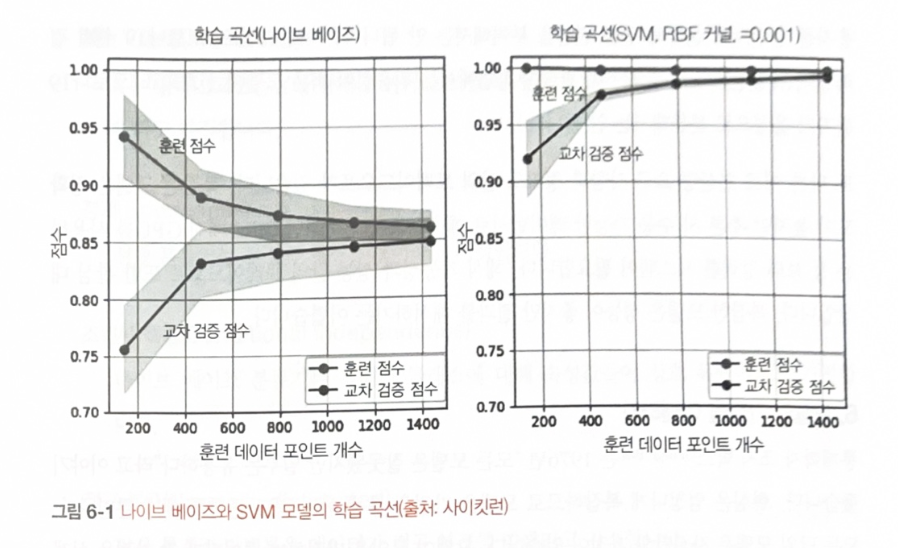

# CH06.  Model Development and Offline Evaluation  
(모델 개발과 오프라인 평가)

- 모델 개발은 반복 프로세스.    
- 반복이 끝날 때마다 모델 성능을 비교   

- 반복 단계 결과물의 성능이 이전 반복 단계와 비교해서 프로덕션 환경에 얼마나  
  적합한지를 평가   

### <6.1 모델 개발과 훈련>     

- 주어진 문제에 대해 다양한 ML 모델 평가하는 방법, 모델 앙상블 생성,    
  실험 추척좌 버전 관리, 분산 훈련 ->(심화)오토ML,즉 문제에 가장 적합한 모델을    
  선택하는 기법

#### 6.1.1 머신러닝 모델 평가    

- 시간과 연산 능력은 한정 -> 어떤 모델을 선택할지 전략적으로 접근 필요   

- 딥러닝이 프로덕션 환경에서 점점 많이 사용되는 추세     
  but, 기존 ML 알고리즘 또한 제자리를 굳건히 지키고 있음    
  많은 추천 시스템이 여전히 협업 필터링과 행렬 분해 기법에 의존ing.   

  그래디언트 부스트 트리 같은 트리 기반 알고리즘은 여전히 레이턴시    
  요구사항이 까다로운 다양한 분류 작업 지원     

- 신경망이 배포된 애플리케이션에도 여전히 고전적인 ML 알고리즘이 함께 사용    
  example, 신경망과 의사 결정 트리는 앙상블로써 함께 사용   
  또, k-mean 클러스터링 모델을 사용해서 신경망에 입력할 피처 추출    
  
  이와 반대로, BERT나 GPT-3과 같이 사전 훈련된 신경망을 사용해   
  로지스틱 회귀 모델에 입력할 임베딩을 생성하기도 함    

- 문제에 대한 모델을 선택할 떄 가용한 모델 전체가 아니라 문제에 일반저긍로 적합한    
  모델 집합에 집중    

  example, 유해한 트윗을 탐지하는 시스템을 개발한다고 가정했을 때,    
  이는 텍스트 분류 문제로, 주어진 텍스트가 유해한지 판별하는 문제이다.    
  텍스트 분류 용도로 흔히 사용하는 모델은 나이브 베이즈, 로지스틱 회귀, 순환 신경망,    
  트랜스포머 기반(BERT, GPT와 그 변종) 등이 있음     

  이상 거래 탐지 시스템을 개발한다고 가정하면, 전형적인 이상탐지 문제는 탐지하고자    
  하는 이상치를 k-nn, 아이솔레이션 포레스트, 클러스터링, 신경망 등 다양한 알고리즘이 사용   

  - 주어진 문제 사용할 모델을 선택하려면 일반적인 ML 작업 유형과 이를 해결하기 위한   
    접근법에 대한 지식이 필요     
   
exmpale, 단순 로지스틱 회구는 복잡한 신겨망보다는 정확도가 낮지만, 시작할 때 필요한 레이블      
데이터 개수가 적고 훈련 속도가 빠르고 배포 과정이 쉬우며 특정 예측값이 나오는 이유를 설명하기 쉬움    

<모델 선택 시 활용할 수 있는 팁>    

- 최첨단만 추종하는 함정에 빠지지 않기   

- 가장 단순한 모델부터 시작하기    
  (zen of Python : 단순함이 복잡한 것보다 낫다)   
  - 단순한 모델 배포(deploy) 쉬움   
  - 모델을 이해하고 디버깅하기 더 쉬움   
  - 가장 단순한 모델 복잡한 모델의 비교 대상으로서 베이스라인(baseline)의 역할 수행   

- 모델을 선택할 때 사람의 편항을 주의하기   
  => 모델 아키텍처 성능은 평가 맥락, 작업, 훈련 데이터, 테스트 데이터, 하이퍼파라미터 등에 크게 좌우되어    
  특정 모델 아키텍처가 다른 아키텍처보다 낫다고 단언하기 어려움    

- 현재 성과와 미래 성과를 비교 평가    

  현재 최적인 모델이 두 달 후에도 최적은 아닐 수 있음   
  학습 곡선으로 데이터가 늘어남에 따라 모델 성능이 어떻게 변할지 가늠 가능   
  모델  학습 곡선은 사용하는 훈련 샘플 개수에 따른 모델 성능의 플롯     
  (ex: 훈련 손실, 훈련 정확도, 검증 정확도)   

  

- 트레이드오프(trade-off) 평가하기    
  -> ML 시스템의 성능을 결정하는 요소 중 무엇이 더 중요한지 이해함   
  연산량 요구사항과 정확도 간의 트레이드 오프 케이스에서 복잡한 모델은 정확도가 높지만   
  추론시 사용 가능한 레이턴시로 예측값을 생성하려면 CPU 대신 GPU를 사용하는 등   
  강력한 시스템이 필요함   
  해석 가능성과 성능 간의 트레이드오프 또한 관심 대상임     
  복잡한 모델은 성능은 좋지만 결과를 해석하기 어려움     

- 모델의 가정을 이해하기
  
  - 예측 가정(Prediction assumption)
    입력 X에서 출력 Y를 예측하는 것이 목표인 모델은 X를 기반으로 Y를 에측할 수 있다 가정  

  - IID(Independent and Identically Distributed)   
    신경망은 각각의 데이터 포인트가 독립적이고 분포가 동일하다고 가정   
    (모든 데이터 포인트가 동일한 결합 분포에서 독립적으로 추출됐다는 의미)    

  - 매끄러움(Smoothness)   
    모든 머신러닝 지도 학습 방법은 입력을 출력으로 변환하는 함수 집합으로 가정함.    
    유사한 입력값은 유사한 출력값으로 변환됨    
    입력 X가 출력 Y를 생성한다면 X에 가까운 입력값은 비례적으로 Y의 가까운 출력값을 생성함     

  - 계산가능성(Tractability)    
    X는 입력이고 Z는 X의 잠재 표현이라고 할 때 생성 모델은 확률(Z|X)를 계산할 수 있다고 가정    

  - 경계(Boundaries)   
    선형 분류기는 결정 경계가 선형이라고 가정    

  - 조건부 독립(Conditional independence)    
    나이브 베이즈 분류기는 정해진 클래스에 대해 속성값들이 상호 독립이라고 가정함    

  - 정규 분포(Normally distributed).  
    많은 통계적 방법론은 데이터가 정규분포를 따른다고 가정함    

  

