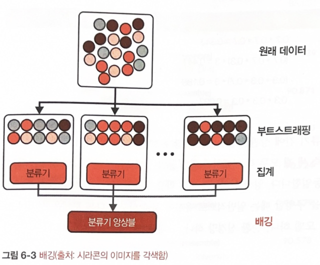
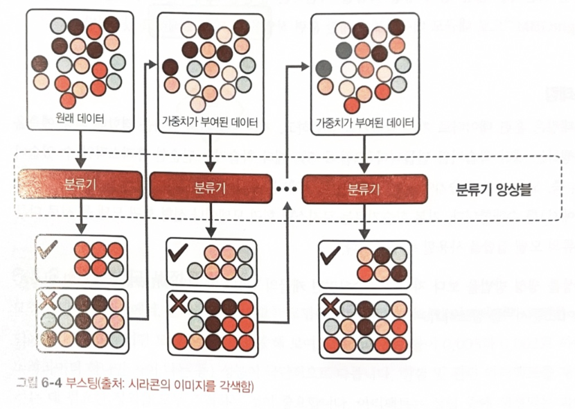
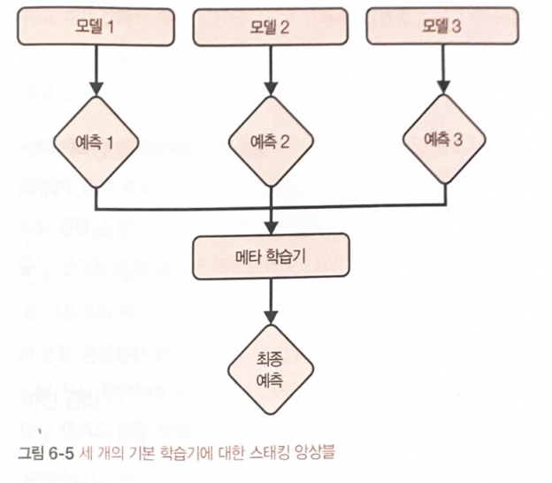
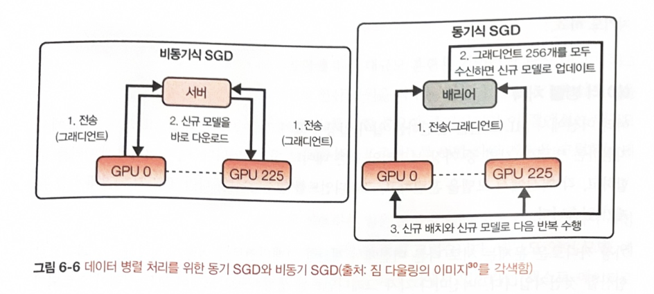

# CH06.  Model Development and Offline Evaluation  
(모델 개발과 오프라인 평가)

- 모델 개발은 반복 프로세스.    
- 반복이 끝날 때마다 모델 성능을 비교   

- 반복 단계 결과물의 성능이 이전 반복 단계와 비교해서 프로덕션 환경에 얼마나  
  적합한지를 평가   

### <6.1 모델 개발과 훈련>     

- 주어진 문제에 대해 다양한 ML 모델 평가하는 방법, 모델 앙상블 생성,    
  실험 추척좌 버전 관리, 분산 훈련 ->(심화)오토ML,즉 문제에 가장 적합한 모델을    
  선택하는 기법

#### 6.1.1 머신러닝 모델 평가    

- 시간과 연산 능력은 한정 -> 어떤 모델을 선택할지 전략적으로 접근 필요   

- 딥러닝이 프로덕션 환경에서 점점 많이 사용되는 추세     
  but, 기존 ML 알고리즘 또한 제자리를 굳건히 지키고 있음    
  많은 추천 시스템이 여전히 협업 필터링과 행렬 분해 기법에 의존ing.   

  그래디언트 부스트 트리 같은 트리 기반 알고리즘은 여전히 레이턴시    
  요구사항이 까다로운 다양한 분류 작업 지원     

- 신경망이 배포된 애플리케이션에도 여전히 고전적인 ML 알고리즘이 함께 사용    
  example, 신경망과 의사 결정 트리는 앙상블로써 함께 사용   
  또, k-mean 클러스터링 모델을 사용해서 신경망에 입력할 피처 추출    
  
  이와 반대로, BERT나 GPT-3과 같이 사전 훈련된 신경망을 사용해   
  로지스틱 회귀 모델에 입력할 임베딩을 생성하기도 함    

- 문제에 대한 모델을 선택할 떄 가용한 모델 전체가 아니라 문제에 일반저긍로 적합한    
  모델 집합에 집중    

  example, 유해한 트윗을 탐지하는 시스템을 개발한다고 가정했을 때,    
  이는 텍스트 분류 문제로, 주어진 텍스트가 유해한지 판별하는 문제이다.    
  텍스트 분류 용도로 흔히 사용하는 모델은 나이브 베이즈, 로지스틱 회귀, 순환 신경망,    
  트랜스포머 기반(BERT, GPT와 그 변종) 등이 있음     

  이상 거래 탐지 시스템을 개발한다고 가정하면, 전형적인 이상탐지 문제는 탐지하고자    
  하는 이상치를 k-nn, 아이솔레이션 포레스트, 클러스터링, 신경망 등 다양한 알고리즘이 사용   

  - 주어진 문제 사용할 모델을 선택하려면 일반적인 ML 작업 유형과 이를 해결하기 위한   
    접근법에 대한 지식이 필요     
   
exmpale, 단순 로지스틱 회구는 복잡한 신겨망보다는 정확도가 낮지만, 시작할 때 필요한 레이블      
데이터 개수가 적고 훈련 속도가 빠르고 배포 과정이 쉬우며 특정 예측값이 나오는 이유를 설명하기 쉬움    

<모델 선택 시 활용할 수 있는 팁>    

- 최첨단만 추종하는 함정에 빠지지 않기   

- 가장 단순한 모델부터 시작하기    
  (zen of Python : 단순함이 복잡한 것보다 낫다)   
  - 단순한 모델 배포(deploy) 쉬움   
  - 모델을 이해하고 디버깅하기 더 쉬움   
  - 가장 단순한 모델 복잡한 모델의 비교 대상으로서 베이스라인(baseline)의 역할 수행   

- 모델을 선택할 때 사람의 편항을 주의하기   
  => 모델 아키텍처 성능은 평가 맥락, 작업, 훈련 데이터, 테스트 데이터, 하이퍼파라미터 등에 크게 좌우되어    
  특정 모델 아키텍처가 다른 아키텍처보다 낫다고 단언하기 어려움    

- 현재 성과와 미래 성과를 비교 평가    

  현재 최적인 모델이 두 달 후에도 최적은 아닐 수 있음   
  학습 곡선으로 데이터가 늘어남에 따라 모델 성능이 어떻게 변할지 가늠 가능   
  모델  학습 곡선은 사용하는 훈련 샘플 개수에 따른 모델 성능의 플롯     
  (ex: 훈련 손실, 훈련 정확도, 검증 정확도)   

  

- 트레이드오프(trade-off) 평가하기    
  -> ML 시스템의 성능을 결정하는 요소 중 무엇이 더 중요한지 이해함   
  연산량 요구사항과 정확도 간의 트레이드 오프 케이스에서 복잡한 모델은 정확도가 높지만   
  추론시 사용 가능한 레이턴시로 예측값을 생성하려면 CPU 대신 GPU를 사용하는 등   
  강력한 시스템이 필요함   
  해석 가능성과 성능 간의 트레이드오프 또한 관심 대상임     
  복잡한 모델은 성능은 좋지만 결과를 해석하기 어려움     

- 모델의 가정을 이해하기
  
  - 예측 가정(Prediction assumption)
    입력 X에서 출력 Y를 예측하는 것이 목표인 모델은 X를 기반으로 Y를 에측할 수 있다 가정  

  - IID(Independent and Identically Distributed)   
    신경망은 각각의 데이터 포인트가 독립적이고 분포가 동일하다고 가정   
    (모든 데이터 포인트가 동일한 결합 분포에서 독립적으로 추출됐다는 의미)    

  - 매끄러움(Smoothness)   
    모든 머신러닝 지도 학습 방법은 입력을 출력으로 변환하는 함수 집합으로 가정함.    
    유사한 입력값은 유사한 출력값으로 변환됨    
    입력 X가 출력 Y를 생성한다면 X에 가까운 입력값은 비례적으로 Y의 가까운 출력값을 생성함     

  - 계산가능성(Tractability)    
    X는 입력이고 Z는 X의 잠재 표현이라고 할 때 생성 모델은 확률(Z|X)를 계산할 수 있다고 가정    

  - 경계(Boundaries)   
    선형 분류기는 결정 경계가 선형이라고 가정    

  - 조건부 독립(Conditional independence)    
    나이브 베이즈 분류기는 정해진 클래스에 대해 속성값들이 상호 독립이라고 가정함    

  - 정규 분포(Normally distributed).  
    많은 통계적 방법론은 데이터가 정규분포를 따른다고 가정함    

  
#### 6.1.2 앙상블(Ensemble)    

- 문제에 어떤 ML 솔루션을 사용할지 처음 고민하는 단계에서는 모델 단 하나만 포함하는 시스템으로 시작하면 좋음     

- 단일 모델을 개발한 뒤에는 성능을 지속적으로 향상하기 위한 방법을 고민하게 되는데, 한 가지 방법은   
  개별 모델이 아니라 여러 모델의 앙상블을 이용해 예측하는 것임   

- 앙상블 내의 각 모델을 기본 학습기(base learner)라고 하는데, 이메일의 스팸 여부를 예측하는  
  작업을 예로 들면 세 가지 모델에서 최종 예측은 세 모델의 다수결 투표로 결정함    

- 앙상블 모델은 배포가 복잡하고 유지 관리가 어려워 프로덕션 환경에서는 선호되지 않지만     
  광고 클릭률 예측 처럼 성능이 조금만 향상되도 금전적 이득이 큰 경우 자주 사용함     

- 앙상블을 구성할 때는 일반적으로 유형이 서로 상당히 다른 모델을 선택함     
  => 예를 들어 트랜스포머 모델 하나, 순환 신경망 하나, 그래디언트 부스트 트리 하나로 구성할 수 있음    

- 앙상블을 만드는 방법은 배깅, 부스팅, 스태킹 등 세가지    
  여러 조사 연구 논문에 따르면 리샘플링과 부스팅, 배깅 같은 앙상블 기법은 성능 항샹 외에도    
  불균형 데이터세 문제 완화에 도움    

- ***배깅(Boostrap Aggregating)***
  ML 알고리즘의 훈련 안정성과 정확도를 모두 개선하도록 설계되어, 분산을 줄이고 과적합 방지   
  데이터셋이 주어진 전체 데이터셋으로 하나의 분류기를 훈련하는 대신 복원 추출을 수행해 여러 데이터셋 생성   
  => 여기서의 각 데이터셋 부트스트랩     
  각 부트스트랩으로 분류 또는 회귀 모델 훈련  
  복원 추출이라 각 부트스트랩은 서로 독립적으로 생성됨   
  분류 문제에서는 모든 모델의 다수결 투표(vote)로 최종 예측값 결정   
  회귀 문제에서 최종 예측값은 모든 모델 예측값의 평균  

  배깅은 일반적으로 불안정성이 높은 기법의 성능을 개선하는데,     
  신경망/분류 및 회귀 트리/선형 회귀의 변수 하위 집합의 선택에 사용     
  반면에 k-최근접 이웃처럼 안정적인 기법의 성능은 다소 저하될 수 있음   

  랜덤 포레스트는 배깅의 일종으로 배깅에 피처의 무작위성을 더해 구성한 의사 결정 트리의 모음으로,    
  각 트리는 무작위로 정한 피처 하위 집합에서 사용할 피처를 선택함    

- ***부스팅***
  부스팅은 약한 학습기를 강한 학습기로 바꾸는 반복 학습 앙상블 알고리즘   
  앙상블을 구성하는 각 학습기는 동일한 샘플 집합으로 학습하지만 반복마다 각 샘플에 가중치를 다르게 줘서,    
  나중에 더해지는 약한 학습기는 이전의 약한 학습기들이 잘못 분류한 데이터 포인트에 집중함    

  [1] 원래 데이터셋으로 첫 번째 약한 분류기 훈련.  
  [2] 샘플마다 첫 번째 분류기에서 얼마나 잘 분류되는지에 따라 가중치 부여. 잘못 분류된 샘플에는 더 높은 가중치 부여  
  [3] 가중치가 부여된 데이터셋으로 두 번째 분류기 훈련. 앙상블을은 첫 번재와 두 번째 분류기로 구성  
  [4] 샘플마다 앙상블에서 얼마나 잘 분류되는지에 따라 가중치 재부여   
  [5] 가중치가 재부여된 데이터셋으로 세 번째 분류기 훈련. 앙상블에서 세번째 분류기 추가  
  [6] 필요한 만큼 반복.    
  [7] 최종적올 기존 분류기의 가중치 조합으로 강한 분류기 구성. 분류기의 훈련 오차가 적을 수록 가중치 높음.  

  부스팅 알고리즘의 예는 약한 결정 트리에서 예측모델을 생성하는 그래디언트 부스팅(GBM(gradient boosting model)  
  으로, 다른 부스팅 방법과 마찬가지로 단계적으로 모델을 구축하고 임의의 미분 가능한 손실 함수를 최적하하면서   
  모델을 일반화함   

  GBM의 변형 알고리즘인 XGBoost는 ML 대회에서 다수의 우승 팀에게 선택받았음   
  분류, 랭킹부터 힉스 보손(Higgs Boson)의 발견에 이르기까지 광범위한 작업에 사용   
  최근에는 병렬 학습을 지원하는 분산형 그래디언트 부스팅 프레임워크인 LightGBM으로   
  대규모 데이터셋에 대한 훈련 작업을 더 빠르게 함    

- ***스태킹***   
  스태킹은 훈련 데이터로 기본 학습기를 훈련하고, 기본 학습기의 출력을 결합해     
  최종 에측을 수행하는 메타 학습기를 만듦. 메타 학습기는 단슨한 휴리스틱일 수 있음   
  모든 기본 학습기에 대해 다수결 투표 (뿐류 작업) 혹은 평균 투표(회귀 작업)을 수행함   
  기본 학습기로는 로지스틱 회귀 모델이나 선형 회귀 모델 등 서로 다른 종류의 모델 집합을 사용할 수 있음   
  (앙상블 생성 방법을 보다 자세히 학습하려면 캐글의 전설적인 팀 MLWave의 멋진 앙상블 가이드 문서 참조)    
  https://oreil.ly/Nu666    
  https://jamm-notnull.tistory.com/16     
  https://jamm-notnull.tistory.com/17     
  https://github.com/MLWave/Kaggle-Ensemble-Guide    

#### 6.1.3 실험 추적과 버전관리    

- 모델 개발 프로세스에서 문제에 가장 적합한 모델을 선택하려면 다양한 아키텍처와    
  모델을 실험해봐야함   

- 실험 및 관련 아티팩트를 재현하는 데 필요한 정의를 모두 추적하는 것이 중요함    

- 아티팩트는 실험 중에 생성되는 파일임   
  ex),손실 곡선, 평가 손실 그래프, 로그, 훈련 프로세스 전반에 걸쳐 생성되는 모델     
  중간 결과 파일 등이 있음.  

- 실험 진행 상황과 결과를 추적하는 과정을 '실험 추적' 이라고 하며,   
  나중에 재현하거나 다른 실험과 비교할 목적으로 실험의 모든 세부 정보를     
  기록하는 프로세스를 '버전 관리' 라고 함    

- MLflow와 weghts & Biases 라는 도구는 실험 추적 용도로 만들어졌다가   
  버전 관리 기능이 통합됨 DVC는 버전 관리 용도로 만들어졌다가 실험 추적 기능이 통합됨   

##### [실험 추적]   

- ML 모델을 훈련할 때 학습 프로세스를 살펴보는 일은 큰 비중을 차지하는데,     
  훈련 과정에서 손실이 감소하지 않는 문제/과대 적합과 과소 적합/가중치 값이     
  오르락내리락하는 문제/뉴런이 죽는 문제/메모리 부족 문제가 있음     

- 이러한 문제를 감지해 해결하고 문모델이 유용한 정보를 제대로 학습하고 있는지       
  평가하려면 훈련 중 발생하는 상황을 계속 추적하는 일이 중요함     

- 훈련 과정에서 실험에 대해 고려할 만한 추적 지표      
  ▷ 손실 곡선 : 훈련 데이터셋과 각 평가 데이터셋에서 측정한 손실 곡선    
  ▷ 모델 성능 지표 : 정확도, F1, 퍼플렉서티 등 테스트를 제외한 데이터셋에서 주로 측정하는 모델 성능 지표   
  ▷ 샘플, 예측값, 그라운드 트루스 레이블 쌍에 대한 로그 : 임시로 빠르게 살펴보는 분석과 새너티 체크(sanity check)   
  ▷ 모델 훈련 속도 : 초당 처리되는 단계 수로 평가하거나, 데이터가 텍스트 일 때는 초당 처리되는 토큰 수로 평가    
  ▷ 시스템 성능 지표 : 메모리 사용량, CPU/GPU 사용률 등으로 병목 현상을 식별하고 시스템 자원 낭비를 방지하는데 매우 중요   
  ▷ 매개변수와 하이퍼파라미터 : 변경 시 모델 성능에 영향을 미치는 모든 매개변수와 하이퍼파라미터의 시간에 따른 값    
  : 학습률(학습률 스케줄 사용하는 경우), 그래디언트 크기(특히 그래디언트 크기를 클리핑 하는 경우), 가중치 크기(특히 가중치 감쇠를 수행하는 경우)   

##### [버전 관리]     

- ML 시스템의 일부는 코드이고 일부는 데이터이므로 코드뿐 아니라 데이터도 버전을 지정해야 함.    
  
- 데이터 버전 관리가 어려운 데는 데이터가 종종 코드보다 훨씬 크기 때문에 코드 버전 관리 전략을    
  데이터 버전 관리에 동일하게 사용하기가 어렵기 때문임    

- 코드 버전 관리는 코드 베이스의 모든 변경사항을 추적함    
  각 변경 사항은 행별로 비교해 측정하는데 코드의 행은 보통 짧아 적절함     
  그러나, 데이터의 경우 특히 이진으로 저장돼 있다면 행은 길어지게 됨    

- 데이터 버전 관리가 어려운 두 번째 이유는 diff를 어떻게 정의할지 명확하지 않고 의견이 분분함.     
  데이터 저장소 내 파일 내용 변경, 즉 diff는 파일이 제거되거나 추가된 경우를 의미하는지?      
  전체 저장소의 체크섬이 변경될 경우를 의미하는지?

  => 2021년 기준 DVC 같은 데이터 버전 관리 도구는 전체 디렉터리의 체크섬이 변경되고 파일이 제거되거나    
  추가됐을 때만 diff를 등록함.    

- 또한, 개발자 1이 데이터 버전 X를 사용해 모델 A를 학습하고, 개발자 2가 데이터 버전 Y를 사용해 모델 B를 학습한다면,    
  데이터 버전 X와 Y를 병합해 Z를 만드는 행위는 의미가 없음 => 'Z'에 해당하는 모델 없음.    

- 데이터 버전 관리가 어려운 이유는 또한 '규정' 대문으로 사용자 데이터로 모델을 훈련한다면     
  일반 데이터 보호 규정(GDPR) 등으로 해당 데이터의 버전 관리가 복잡해짐    
  => 규정상 사용자가 데이터 삭제를 요청하면 해당 사용자의 데이터를 즉각 삭제해야하므로     
  이전 버전의 데이터를 복구하는 일이 법적으로 불가능해짐     

- 꼼꼼한 실험 추적과 버전 관리는 재현성에 도움이 되지만 재현성을 완전히 보장하지는 않음.   
  사용하는 프레임워크나 하드웨어는 종종 실험 결과에 비결정론적 성질을 주입해 실험이 실행되는 환경에 대해     
  모든 것을 알지 못하면 실험 결과를 복제하는 일 자체가 불가능 하기도 함.     

##### [ML 모델 디버깅]     

- 디버깅은 소프트웨어 개발의 본질적인 요소로, ML 모델도 예외는 아님    
  ML 모델 디버깅에는 여러 어려운점이 발생함    

(1) ML 모델의 실행은 명시적인 중단이나 출력 없이 조용히 실패함   
코드가 컴파일되고, 손실이 예상되로 감소하고 올바른 함수가 호출되어 예측은 이뤄졌지만 예측값이 잘못 됨.    

(2) 버그를 찾았다고 해도 버그가 수정됐는지 확인하는 작업이 느림     
전통적인 소프트웨어 프로그램을 디버깅할 때는 버그가 있는 코드를 변경하고 그 결과를 즉시 확인할 수 있지만   
ML 모델을 변경할 때는 그렇지 않음     
모델을 다시 학습시키고 버그가 수정됐는지 확인하기 위해 모델이 수렴할 때 까지 기다려야함     
모델이 사용자에게 배포될때 까지 버그가 수정됐는지 확신할 수 도 없음     

(3) ML 모델 디버깅은 기능 간 복잡도로 인해 까다로움.     
ML 시스템에는 데이터, 레이블, 피처, ML 알고리즘, 코드, 인프라 등 다양한 구성 요소가 있으며     
구성 요소마다 서로 다른 팀에서 관장하곤 함     
데이터는 데이터 엔지니어가 레이블은 도메인 전문가, ML 알고리즘은 데이터 과학자가     
인프라는 ML 엔지니어나 ML 플랫폼 팀에서 관리함      
오류가 발생하면 그 원이니 한 가지 구성 요소 혹은 여러 구성 요소의 조합일 수 있어 어디를 살펴봐야하고    
누가 조사해야 할지 결정하기 어려움      

##### ML 모델 실패 원인    

(1) 이론상 제약 조건     

- 각 모델은 데이터와 그것이 이용하는 피처에 대한 고유한 가정을함   
  모델이 학습하는 데이터가 그 가정에 부합하지 않아서 모델이 실패할 수 있음    
  실패의 한가지 예는 결정 경계가 선형이 아닌 데이터를 가지고 선형 모델을 사용하는 경우    

(2) 잘못된 모델 구현   

- 모델이 데이터에 적합할지라도 모델 구현상 버그가 있을 수 있음    
  파이토치를 사용한다면 평가 중에는 그래디언트 업데이트가 안되도록 설정해야 하는데, 깜빡하는 경우가 있음    
  모델에 구성 요소가 많을수록 문제가 생길 가능성이 높고 어디에 문제가 생겼는지 파악하기가 어려움    
  모델이 점차 제품화되고 미리 준비된 모델을 사용하는 회사가 늘어나면서 이 문제는 완화되고 있음    

(3) 잘못된 하이퍼파라미터 선택

- 같은 모델이어도 어떤 하이퍼파라미터 집합에서는 최고의 결과를 만드는 반면 다른 하이퍼파라미터 집합에서는    
  수렴조차 하지 않음     
  모델이 데이터에 매우 적합하고 구현이 정확해도 하이퍼파라미터 집합이 잘못되면 해당 모델은 쓸모 없어짐    

  
(4) 데이터 문제

- 데이터 수집과 전처리 단의 다양한 문제로 모델의 성능이 저하될 수 있음   
  데이터 샘플과 레이블 쌍이 잘못 연결되거나 레이블에 잡음이 있거나,     
  오래된 통계량으로 피처를 정규화하면 모델의 성능을 야기함    

(5) 잘못된 피처 선택

- 모델 학습에 사용 가능한 피처가 많을 때, 피처를 너무 많이 사용하면 모델이 훈련 데이터에 과적합되거나    
  데이터 누수가 발생할 수 있음    
  반대로 피처를 너무 적게 사용하면 모델이 예측을 제대로 못하는 예측력 부족 현상 발생    

=> ML 디버깅에 대한 과학적 접근법은 없지만, 경험이 풍부한 ML 엔지니어와 연구원이 제시하고 검증한      
디버깅 기법이 몇 가지 있음      

[1] 단순하게 시작하고 점진적으로 구성 요소 추가

- 가장 단순한 모델에서 시작해 구성 요소를 천천히 추가하면서 성능이 향상되는지 하락하는지 확인    
  ex] 순환 신경망(RNN) 구축시 여러 층을 한꺼번에 쌓거나 여러 정규화 층을 추가하기 앞서 RNN 셀 한층으로 시작해봄.   
  마스크 언어 모델(MLM)과 다음 문장 예측(NSP) 손실을 모두 사용하는 BERT 모델은 NSP 손실을 추가전에    
  MLM 손실만 적용해봄.   

[2] 단일 배치에 과접합시키기

- 모델을 단순하게 구현해 소량의 훈련 데이터로 과적합시키고,    
  동일한 데이터를 평가해서 도달 가능한 최소 손실을 달성하는지 확인함.    
  이미지 인식 작업이면 이미지 10개에 과적합 시켜서 100%의 정확도를 얻는지 확인하고,    
  기계 번역 작업이라면 문장 쌍 100개에 괒거합 시켜 BLEU 점수가 100에 가까운지 확인함.      
  데이터가 적은데도 과적합이 안되면 구현에 문제가 있을 수 있음     

[3] 무작위 시드 값을 고정하기

- 가중치 초기화, 드롭아웃, 데이터 셔플링 등 모델에 무작위성을 가져오는 요인들이 너무 많아,    
  다양한 실험 결과를 비교하기 어렵게 함    
  성능 변화가 모델 때문인지 달라진 무작위 시드 값 때문인지 알기 어려움   
  무작위 시드 값을 고정하면 서로 다른 실행 간에 일관성이 보장되며 오류 상황이나 다른 사람의 결과를 재현해 낼 수 있음   

#### [6.1.4 분산훈련]     

- 모델이 커지고 자원을 대량으로 사용함에 따라 대규모 훈련은 기업들의 관심 대상이 되고 있음.    
  확장성에 대한 전문성은 대규모 연산 자원을 다루는 경험이 필요하여 쉽게 얻을 수 없음     

- 데이터가 메모리 크기보다 크다면 데이터 전처리(예: 0으로 중심값 맞추기, 정규화, 화이트닝),   
  셔플링, 데이터 배치 분할 처리를 수행하는 알고리즘 작업을 아웃 오브 코어 형태 그리고 병렬 처리해야 함    

- 데이터 샘플의 크기가 크다면, 머신 한 대로 한번에 처리 가능한 샘플 수가 적다면 작은 배치로 연산을 처리해야 하는데   
  이로 인해 경사 하강법 기반 최적화 작업이 불안정해짐    

- 때때로 데이터 샘플 하나가 메모리 크기를 넘어설 정도로 거대하고, 머신이 적은 메모리로    
  더 많은 연산을 할 수 있도록 메모리 풋프린트와 연산의 트레이드오프 관계를 활용하는     
  그래디언트 체크포인팅 기법을 사용해야 함

- 샘플이 메모리에 충분히 올라가는 크기라도 체크포인팅을 이용하면 배치 하나에 더 많은 샘플을 담을 수 있음    

##### [데이터 병렬 처리]    

- 여러 머신에서 ML 모델을 훈련하는 일이 일상화되고 있고, 최신 ML 프레임워크에서 지원하는   
  병렬화 기법 중 가장 보편적인 것은 데이터 **병렬화** 임   
  => 여러 머신에 데이터를 분할하고, 각 머신에서 모델을 훈련하고, 그래디언트를 합산함

- 위 방법은 서로 다른 머신에서 계산한 그래디언트를 어떻게 정확하고 효과적으로 합산할 것인지가 문제임      
  머신마다 각자 그래디언트를 생성하므로 모델이 모든 실행이 완료되기를 기다린다면,      
  동기식 확률적 경사 하강법(Synchronous Stocastic Gradient Descent; SGD)를 사용한다면     
  작업 속도가 느린 머신 하나가 전체 시스템의 속도를 늦추고 시간과 자원을 낭비하게 됨     
  이러한 낙오자 문제(straggler problem)은 머신 대수가 늘어날수록 심각해짐    
  작업자가 많을수록 특정 반복에서 비정상적으로 느리게 실행되는 작업자가 적어도 한 대 이상일 확률이 높아짐    

=> 이를 모델이 각 머신의 그래디언트를 사용해 개별적으로 가중치를 업데이트한다면, 즉 비동기식      
SGD를 사용하면 한 머신의 그래디언트가 다른 머신의 그래디언트를 입수하기 전에 가중치를       
바꿔버리므로 최신이 아닌 그래디언트를 적용하면서 생기는 그래디언트 부패(gradient staleness)가 발생할 수 있음     

- 이론상 비동기식 SGD는 수렴하긴 하지만 동기식 SGD보다 더 많은 반복이 필요함.     

- 실제로 가중치 수가 많을 때 그레디언트 업데이트는 희소하게 이뤄지는 경향이 이음.    
  즉 배두분의 그래디언트 업데이트는 일부 매개변수만 수정하며 서로 다른 머신    
  두 개의 그래디언트 업데이트가 동일한 가중치를 수정할 가능성은 적음.     
  그래디언트 업데이트가 희소하면 앞서 언급한 그래디언트 부패 문제가 줄어들고 모델의 경우   
  동기식, 비동기식 SGD 모두 유사하게 수렴함      

- 모델을 여러 머신에 복제하면 배치가 매우 커지는 문제가 발생하는데,     
  머신 한 대가 1,000개 짜리 배치를 처리하면 머신 1,000대는 100만 개 짜리 배치를 처리함.    
  계산을 단순화 해 머신 한 대에서 에폭 하나를 훈련하는데 100만회 반복해야 한다면,     
  머신 1,000대 에서는 1,000회만 반복하면 됨      
  단순한 해결책으로 반복마다 더 많이 학습하도록 학습률을 높이는 바업이 떠오르긴 하지만,    
  수렴이 불안정해지는 상황을 종종 야기하므로 학습률을 너무 크게 만들 수는 없음.    
  실제로 배치 크기를 늘리다가 특정 지점이 넘어섬녀 이득이 되레 감소함.    

- 모델 설정은 동일하게 가져가면서 주 작업자가 다른 작업자보다 자원을 더 많이 사용하는 문제가 종종 발생하는데,     
  모든 머신을 최대한 활용하려면 각 머신간의 워크로드가 균형을 이뤄야함.    
  가장 쉬운 방법은 주 작업자에게 좀 더 작은 배치 크기를 설정하고,     
  다른 작업자에게 좀 더 큰 배치 크기를 설정하는 것      

##### [모델 병렬 처리]     

- 데이터 병렬 처리 기법에서는 각 작업자가 모델 전체를 복제해와서 그것과 관련된 모든 계산을 수행하지만,     
  모델 병렬 처리는 모델이 각기 다른 구성 요소를 서로 다른 머신에서 훈련함       

  예를 들어, 머신 0은 처음 두 레이어에 대한 계산을 처리하고 머신 1은 다음 두 레이어를 처리함.     
  혹은 특정 머신이 정방향 패스를 처리하고 다른 머신은 역방향 패스를 처리함     

- 모델 병렬화이지만 가끔 서로 다른 머신에 있는 모델의 서로 다른 부분이 동시에 병렬로 실행되지 않음     
  ex] 모델이 방대한 행렬이고 머신 두 대가 그 행렬을 양분해 처리한다면 각각의 절반은 병렬로 실행된다.      
  하지만 모델이 신경망이며 머신 1에 첫 번째 레이어를 할당하고 머신2에 두 번째 레이어를 할당한 경우,      
  레이어 2를 실행하려면 레이어 1의 출력이 필요하며 머신 2는 머신 1이 완료될 때까지 기다려야 함.    

- **파이프라인 병렬 처리(pipeline paralleism)** 은 서로 다른 머신에 있는     
  모델의 서로 다른 구성 요소들이 좀 더 병렬화해 처리되도록 고안한 기법     
  다양한 변형이 있지만 각 머신의 계산을 여러 부분으로 잘게 나누는 것으로,    
  머신 1이 계산의 첫 번째 부분을 완료하면 그 결과를 머신 2에 전달하고 두 번째 부분으로 넘어가는 식임.     
  머신 2는 첫 번째 부분에서 계산을 실행하고 머신 1은 두 번째 부분에 계산을 실행하게 됨      

  예를 들어, 서로 다른 머신 4개가 있고 첫 번째, 두 번째, 세 번째, 네 번째 레이어를   
  각각 다른 머신 1,2,3,4가 들고 있다고 가정할 때, 파이프라인 병렬 처리의 경우 각 미니 배치는     
  마이크로 배치 4개로 나뉨      
  머신 1은 첫 번째 마이크로 배치에서 첫 번째 레이어를 계산하고, 머신 2가 머신 1의 결과로    
  두 번째 레이어를 계산하는 동안 머신 1은 다시 두번째 마이크로 배치에서 첫 번째 레이어를 계산함.     

- 모델 병렬 처리와 데이터 병렬 처리는 상호베타적이지 않음.     

- 많은 회사에서 화드웨어 활용도를 높이기 위해 두 방법을 모두 사용하지만, 엔지니어링에 상당한 시간과 노력이 듬    

##### [오토ML]     

- 오토ML이란 실제 문제를 풀기 위해 ML 알고리즘 탐색 프로세스르 자동화하는 것   

- 단순하면서도 프로덕션 환경에서 가장 인기 있는 형태의 오토ML은 하이퍼파라미터 조정 프로세스임  

- 하이퍼파라미터는 사용자가 제공하는 매개변수로 학습률/배치 크기/은닉층 수/은닉 유닛 수/드롭아웃 확률   
  / 애덤 옵티마이저의 베타1, 베타2의 학습 과정을 제어하는 값 등이 있다.    
  특히,양자화 숫자를 32비트, 16비트, 8비트로 표현할지 이들의 혼합으로 표현할지도 하이퍼파라미터 조정 대상임     

- 사용하는 하이퍼파라미터 집합이 다르면 동일한 모델과 동일한 데이터셋에서 완전히 다른 성능이 나타날 수 있다.    
  하이퍼파라미터 조정의 목표는 검증 세트에 대한 각 하이퍼파라미터 집합의 성능을 평가해 탐색 공간 안에서      
  주어진 모델에 대한 최적의 집합을 찾아내는 것임      

- 많은 사람들이 수동의 직관적인 접근법을 선호하여, 하이퍼파라미터 조정에 대한 체계적인 접근법을 무시하고 있음.   
  그러나 점점 하이퍼파라미터 조정 단계를 표준 파이프라인 일부로 포함시키고 있으며 인기 있는 ML 프레임워크는   
  하이퍼파라미터 조정을 위한 유틸리티를 내장하거나 타사 유틸리티를 포함함    
  ex, 사이킷런의 auto-skleadrn, 텐서플로의 keras Tuner, 레이의 Tune이있음.  

- 하이퍼파라미터 조정 기법은 무작위 탐색, 격자 탐색, 베이즈 최적화가 인기 있음   

- 모델 성능은 여러 개의 하이퍼파라미터보다 특정 하이퍼파라미터 변경에 더 민감하게 바뀔수 있어    
  민감한 하이퍼파라미터는더 신중하게 조정해야 함.    

- 테스트세트로 하이퍼파라미터를 조정해서는 안되고, 검증 세트의 성능을 기반으로 모델에    
  가장 적합한 하이퍼파라미터 집합을 선택하고 테스트 세트에서는 모델의 최종 성능을 살펴만 봄.    
  테스트 세트로 조정한 하이퍼파라미터를 사용하면 모델이 테스트 세트에 과적합됨     

##### 하드 오토ML: 아키텍처 탐색과 학습된 옵티마이저     

- 모델의 서로 다른 구성 요소 혹은 모델 전체를 하이퍼파라미터로 간주하여 합성곱 레이어 크기나 스킵 레이어 유무 등을   
  하이퍼파라미터의 일종으로 생각해서 수작업으로 합성곱 레이어 다음에 풀링 레이어를 배치하거나 선형 다음에    
  ReLU(정류 선형 단위)를 배치하는 대신 알고리즘에 이러한 구성 단위들을 제공하고 결합할 방법을 알아내게끔 하는    
  연구가 신경망 아키텍처 탐색(Neural Architecture Search; NAS)라고 하는데,    
  최적의 신경망 모델 아키텍처를 탐색한다는 의미임   

- NAS 설정      

[1] 탐색 공간:   
가능한 모델 아키텍처 범위 정의, 선택 가능한 구성 단위와 이를 결합하는 방법에 대한 제약조건 정의   

[2] 성능 추적 전략:    
각 아키텍처 후보를 밑바닥부터 수렴할 때까지 훈련할 필요 없이 성능을 평가할 수 있어야함.    
아키텍처 후보가 매우 많을 때(예컨데 1,000개) 모두 수렴할 때까지 훈련해야 한다면 엄청난 비용이 듦    

[3] 탐색 전략    
탐색 공간을 탐험함. 단순한 접근법으로 가능한 모든 설정 값을 무작위로 선택하는 무작위 탐색 방법이 있음      
하지만 NAS에서조차 엄청난 비용을 야기하므로 인기가 없음.     
보다 일반적인 접근법으로 강화학습(성능 평가를 개선하는 선택지에 보상하기),    
진화(아키텍처에 여러 변형을 더하고, 성능이 가장 좋은 것을 선택하고 다시 변형을 더하기)가 있음    

- NAS의 경우 탐색 공간이 이산 형태이므로(최종 아키텍처는 각 레이어 및 작업에 대해 사용 가능한 옵션 중 하나를 선택함)  
  구성 단위의 집합을 NAS에 제공해줘야 함    

- 일반적인 구성 단위는 다양한 크기와 여러 종류의 합성곱, 선형, 여러 종류의 활성화,    
  풀링, 항등, 0, 레이어 등임. 구성 단위의 집합은 기본 아키텍처, 합성곱 신경망이나 트랜스포머 여부에 따라 달라짐    

- 일반적인 ML 훈련 프로세스에서는 모델과 학습 절차, 즉 데이터셋에 대해 목적 함수를 최적화하면서    
  모델 매개변수의 집합을 찾아내는 알고리즘을 갖춰야 함    

- 오늘날 신경망에 가장 보편적으로 사용하는 학습 절차는 옵티마이저를 활용해 주어진 그래디언트    
  업데이트로부터 모델 가중치를 업데이트 하는 방법인 경사하강법임    
  인기 있는 옵티마이저로 애덤, 모맨텀, SGD 등이 있음   

- 이론상으로 옵티마이저를 NAS 구성 단위에 포함시켜 가장 잘 작동하는 것을 탐색하면 되지만,    
  옵티마이저는 하이퍼파라미터 설정에 민감하고 기본 하이퍼파라미터가 아키텍처 후보 전체에서     
  두루 잘 동작하지 않아 해당 방법을 적용하기 어려움    

- 학습된 옵티마이저 역시 신경망이라 훈련이 필요한데, 학습된 옵티마이저는 나머지 신경망과 동일한 데이터셋에서   
  훈련할 수 있지만 이렇게 하면 작업 때마다 옵티마이저를 새로 훈련해야 함   

- 기존 작업 집합으로 옵티마이저를 한번 더 학습시켜서 새로운 작업마다 사용하는 접근법도 있는데,    
  옵티마이저를 학습시킬 때는 기존 작업의 합산 손실을 손실 함수로, 수작업으로 만든 옵티마이저를   
  학습 규칙으로 사용함
  이 접근법은 학습된 옵티마이저를 자체 개선하는식으로 더 좋은 옵티마이저를 훈련하는데 사용할 수 있다는 점임    

- 아키텍처 탐색이든 메타 러닝 학습 규칙, 선행 훈련 비용은 전 세계 몇몇 회사만 감당할수 있을 정도로 비쌈.   
  그러나 프로덕션 환경 ML에 관심이 있다면 오토ML 진행 상황을 눈여겨 봐야 하는데,    
  결과로 나온 아키텍처와 학습된 옵티마이저는 ML 알고리즘이 다양한 실제 작업에서 즉각 동작하도록 하며   
  훈련과 추론 단계의 생산 시간과 비용을 줄여줌.    
  오토 ML은 기존 아키텍처와 옵티마이저만으로 불가능했던 실제 작업을 해결할 수 있음    

##### [ML 모델 개발의 네가지 단계]   

- ML 채택에는 네 가지 단계가 있는데, 단계별 솔루션은 다음 단계의 솔루션을 평가하기    
  위한 베이스라인으로 사용 가능하다.    

1단계: 머신러닝 도입 전    

- 데이터를 활용한 예측이 처음이라면 ML이 아닌 솔루션을 먼저 시도한다    
- 가장 단순한 휴리스틱을 적용함    
  예를 들어 사용자가 다음으로 입력할 영문자 예측 시 가장 자주 쓰는    
  영문자 상위 3개 'e','t','a'를 제시하면 정확도를 30%를 달성함   

- 머신러닝으로 100% 향상되리라 예상한다면 휴리스틱만 적용해도 50% 향상 될 수 있음    

2단계: 가장 단순한 머신러닝 모델 사용하기    

- 첫 번째 ML 모델로는 단순한 알고리즘으로 시작하는 편이 좋은데, 문제 유형과 데이터의 유용성을 접근할 수 있도록   
  작업에 대한 가시성 확보가 가능해야 한다.    
- 로지스틱 회귀, 그래디언트 부스트 트리, K-최근접 이웃등과 같이 구현과 배포가 쉬워 데이터 엔지니어링부터   
  개발, 배포에 이르기까지 프레임워크를 빠르게 구축하고 테스트 한다.     

3단계: 단순한 모델 최적화하기   

- ML 프레임워크가 준비되면 단순한 ML 모델을 최적화하는데 집중할 수 있다.   
  다양한 목적 함수, 하이퍼파라미터 탐색, 피처 엔제니어링, 더 많은 데이터와 앙상블을 사용한다.    

4단계 : 복잡한 모델 사용하기   
- 단순한 모델이 한계에 도달해 상당한 모델 개선이 필요하면 더 복잡한 모델을 실험한다.    

### <6.2 모델 오프라인 평가>    