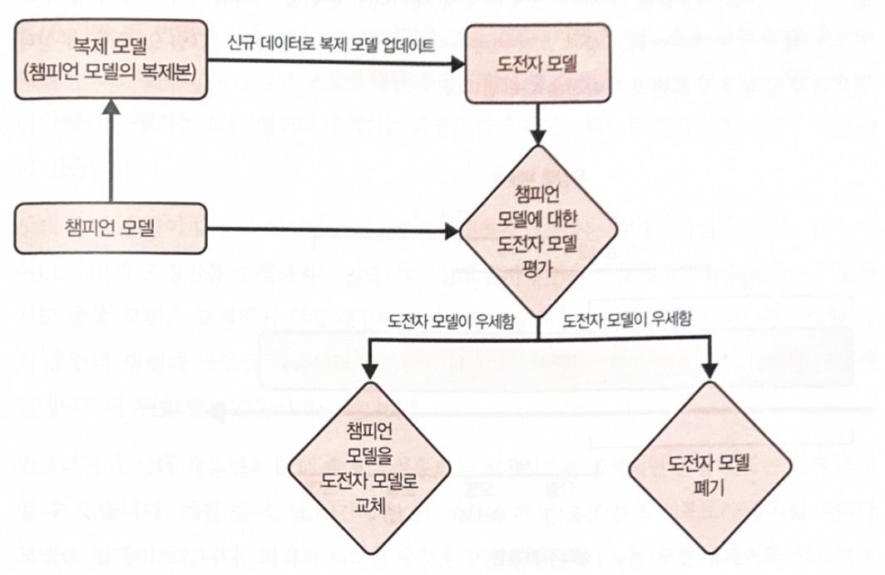
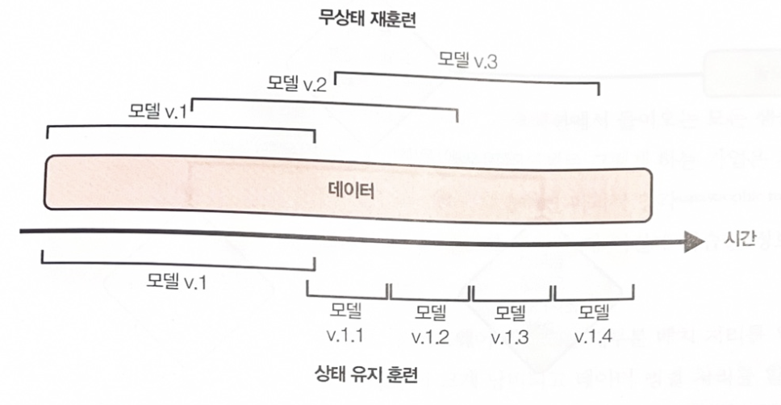
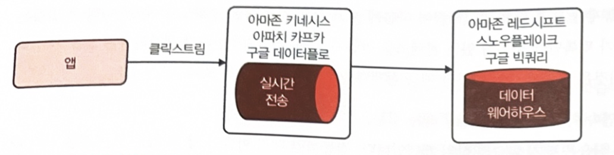

# CH09 연속 학습과 프로덕션 테스트(Continual Learning and Test in Production)

- 연속 학습은 주로 인프라 문제    
- 모델을 얼마나 재훈련 해야하는지, 원하는 만큼 자주 업데이트 하도록    
  인프라를 설정한 후에 재훈련 빈도 고려해야 함     

- 고정 테스트 세트에서 평가하는 것은 충분 x.    
  어렵지만 꼭 필요한 개념인 프로덕션 테스트를 다룸    

- 이 프로세스는 프로덕션에서 라이브 데이터로 시스템을 테스트하는 방법으로,    
  업데이트된 모델이 파괴적인 결과 없이 제대로 작동하는지 확인     

## 9.1 연속 학습     

- '연속학습' 모델이 프로덕션에서 들어오는 모든 샘플로 스스로 업데이트하는    
  훈련 패러다임 생각 -> 하지만 실제로 그렇게 하는 기업 거의 없음     

- 첫쩨, 모델이 신경망이라면 모든 입력 샘플로 학습하면    
  파괴적 망각(catastrophic. forgetting)에 취약해짐     
  파괴적 망각은 신경망이 새로운 정보를 학습할 때  이전에 학습한 정보를    
  갑자기 잊어버리는 경향     

- 둘째, 훈련 비용이 더 많이 듦. 오늘날 백엔드는 대부분 배치 처리를 위해 설계    
  샘플을 하나씩 처리하면 연산 성능이 크게 낭비되고 데이터 병렬 처리를 활용할 수 없음    

- 프로덕션에서 연속 학습을 사용하는 회사는 모델을 마이크로 배치로 업데이트   
  Ex] 데이너 포인트 512개마다 혹은 1024개마다 기존 모델을 업데이트함.    
  각 마이크로 배치의 최적 샘플 개수는 작업에 따라 다름    

- 업데이트된 모델은 평가가 완료될 떄까지 배포 x. 즉, 기존 모델을 직접 변경해선 안됨    
  대신 기존 모델의 복제본을 생성해 신규 데이터로 업데이트하고,    
  업데이트된 복제본이 더 낫다고  판명할 때만 기존 모델을 업데이트된 복제본으로 교체     

  기존 모델을 챔피언(champion) 모델, 업데이트된 복제 모델을 도전자(challenger)   
  실제로 회사에는 동시에 여러 도전자 모델이 있으며 실패한 모델이 있으며    
  실패한 도전자 모델을 다루는 과정은 단순 폐기보다 훨씬 정교    




- 대부분의 회사에서 모델을 자주 업데이트 할 필요가 없다고 주장(이유 2가지)    
  
- 첫째, 재훈련 일정이 타당할 만큼 충분한 트래픽, 즉 충분한 신규 데이터가 없기 때문    

- 둘째, 모델 성능이 그렇게 빨리 떨어지지 않기 때문(필자는 이 의견에 동의)   
  
- 재훈련 일정을 일주일에서 하루로 변경해도 수익이 나지 않고 더많은 오버헤드가 발생한다면   
  모델을 자주 업데이트 할 필요 없음    


### 9.1.1 무상태 재훈련 vs 상태 유지 훈련    

- 연속학습은 재훈련 빈도가 아니라 모델 재훈련 방식과 관련    
  
- 대부분 무상태 재훈련(stateless retraining)을 수행해 모델이 매번 처음부터 훈련   

- 연속 학습은 상태 유지 훈련(stateful training)을 허용함을 의미하며    
  모델은 신규 데이터로  훈련을 지속    

  상태 유지 훈련은 미세 조정(fine-tunning) 혹은   
  중복 훈련(incremental training)이라고 도 함    




- 상태 유지 훈련을 사용하면 더 적은 데이터로 모델을 업데이트    
  모델을 처음부터 훈련하려면 동일한 모델을 미세 조정할 때보다 데이터가 훨씬 많이 필요    

  ex] 모델을 처음부터 다시 훈련하려면 지난 3개월 데이터를 모두 사용해야 할 수 있지만    
  이제 체크포인트에서 모델을 미세 조정하려면 마지막 날 데이터만 사용하면 됨    

- 그럽허브는 상태 유지 훈련을 하면 모델이 더 빠르게 수렴하며   
  필요한 연산 비용도 훨씬 적음을 발견   

  일일 무상태 재훈련에서 일일 상태 유지훈련으로 전환하자   
  훈련 연산 비용이 45분의 1로 감소,  구매율(purchase-through rate) 20% 증가    

- 상태 유지 훈련을 하면 데이터를 완전히 저장하는 일을 피할 수 있음    
  기존 무상태 재훈련에서 데이터 샘플을 모델을 여러번 반복 훈련하는 동안 재사용됨   
  그런데 데이터 저장이 항상 가능하지 않음(특히 개인정보보호 요구사항이 엄격한 경우)   


- 상태 유지 훈련 패러다임에서는 신규 데이터로만 훈련되므로    
  한 데이터 샘플은 훈련에 한 번만 사용   
  즉, 데이터를 영구 스토리지에 저장할 필요 없이 모델 훈련이 이루어지므로 
  개인 정보 보호에 대한 우려 많이 덜음    


- 상태 유지 훈련이 대량의 데이터로 처음부터 훈련하지 않는다는 의미가 아님    
  즉, 신규 데이터로 미세 조정만 수행하지는 않음      
  
  상태 유지 훈련을 가장 성공적으로 적용한 기업에서도 종종 모델을 교정하기 위해    
  대량의 데이터로 처음부터 모델을 훈련함.     
  혹은 상태 유지 훈련과 병행해 모델을 처음부터 훈련하고 파라미터 서버    
  같은 기술을 사용해 업데이트된 두 모델을 결합하기도 함.    

- 인프라가 무상태 재훈련과 상태 유지 훈련을 모두 허용하도록 설정되면    
  훈련 빈도는 쉽게 조정 가능    


- 모델에 신규 피처나 다른 레이어를 추가하고 싶다면 어떻게 작동 ?   
  두가지 모델 업데이트 유형을 구별해야 함    

  - 모델 반복(Model iteration).  
  : 기존 모델 아키텍처에 새로운 피처가 추가되거나 모델 아키텍처가 변경됨     

  - 데이터 반복(Data iteration).  
  : 모델 아키텍쳐와 피처는 동일하게 유지되지만 신규 데이터로 모델을 갱신    


- 오늘날 상태 유지 훈련은 대부분 데이터 반복에 적용   
  
- 모델 아키텍처를 변경하거나 새로운 피처를 추가하려면 모델을 처음부터 훈련해야 함   
  
- 모델 반복의 경우 구글의 'knowledg transfer'와 OpenAI 'model surgery' 같은   
  기법을 사용해 처음부터 훈련을 우회할수 있다는 연구 결과 존재    

  OpenAI에서는 surgery는 선택 프로세스 후에 훈련된 가중치를 한 네트워크에서    
  다른 네트워크로 전송    
  이 포르세슨느 모델에서 어던 부분이 변경되지 않으면 어떤 부분을 다시 초기화해야 하는지   
  결정하기 위함    


***애매한 용어***

- '온라인 학습'이라는 용어 대신 '연속 학습(continual learning)' 용어 사용    

- continuous learning 대신 continual learning 이라는 용어 사용

- continuous learning은 모델이 들어오는 샘플로 지속적으로 학습하는 체제를 의미   

- continual learning에서는 학습이 일련의 배치 혹은 마이크로 배치로 수행   

- cotinuous learning은 때때로 ML의 지속적인 제공(continous delivery(CD))을   
  지정하는데 사용되는데,     
  CD는 continual learning과 밀절합 관련이 있음    

  continuous learning은 기업이 ML 모델의 반복 주기를 가속화하는 데 도움이 됨   
  다만 차이점은 이러한 의미로 사용될떄   
  continuous learning은 CD를 위한 파이프라인 설정에 대한 DevOps 관점   
  continual learning 은 ML 관점에서 사용   


### 9.1.2 연속 학습의 필요성     

- 연속학습은 모델을 업데이트하고 변경 사항을 원하는 만큼 빠르게 배포할 수 있도록   
  인프라를 설정하는 것    

1. 데이터 분포 시프트, 특히 갑자기 발생하는 시프트에 대처하는 일.
   
   Ex] 리프트 같은 승차 공유 서비스의 가격 결정 모델을 구축한다고 가정할때,    
   특정 지역은 역사적으로 목요일 저녁에 운행 수가 적고,    
   따라서 모델이 낮은 운행가격을 예측해 운전자자 운행을 선호 x.    
   그런데 이번 목요일은 저녁에 동네에 큰 행사가 있어 운행 수요가 급증.   
   모델이 이러한 변화에 빠르게 대응할 수 있다면 높은 운행 가격을 예측하고    
   더 많은 운전자를 동원하겠지만,    
   반대로 충분히 빠르게 대응할 수 없다면 탑승하는 승차하기 위해    
   오랫동안 기다려야하고 이는 부정적인 사용자 경험을 유발.       
   심지어 탑승자가 경쟁사 앱을 전환해 수익을 잃을 가능성도 존재.     
 

2. 희귀한 사건(rare event)에 적응하는 것.

  Ex]전자 상거래 웹사이트에서 일한다고 가정.   
  블랙 프라이 데이는 1년에 단 한번 열리는 중요한 쇼핑 이벤트에 해당.    
  하지만 이번 블랙 프라이데이 기간의 고객 행동을 정확하게 예측할 수 있도록    
  모델에 대한 과거 데이터를 충분히 수집할 방법은 없음.     
  성능을 향상시키리면 모델이 하루 종일 신규 데이터로 훈련해야 함.   
  2019년 알리바바는 스트리림 처리 프레임워크인 아파치 플링크의 개발을     
  주도하는 데이터 아티산 팀을 1억 300만 달러에 인수했고,    
  팀은 플링크를 ML 유스 케이스에 적응시키는데 도움을 줌.    
  주요 유스케이스는 미국의 블랙 프라이 데이와 유사한    
  중국 쇼핑 이벤트인 광군제에 더 좋은 추천을 수행하는 것.   
 

3. 오늘날 ML 프로덕션의 주요 난제인 지속 콜드 스타트(continuous cold start)    
   문제에도 도움이 됨.     

   콜드 스타트 문제는 모델이 과거 데이터 없이 신규 사용자를 예측해야 할 때 발생.    
   Ex] 추천 시스템에서 사용자에게 추천을 하기 위해서는 과거 이력을 알아야 함.    
   그러나 해당 사용자가 신규 사용자라면 기록이 없으므로 현재 가장 인기 있는    
   영화같이 일반적인 추천 리스트를 생성해야 함.    

   지속 코드 스타트는 콜드 스타트 문제를 일반화 한 것으로,     
   신규 사용자뿐 아니라 기존 사용자에게도 발생.    
   Ex]기존 사용자가 노트북에서 휴대 전화로 전환하는데 휴대전화에서 동작이   
   노트북에서와 달라서 발생하기도 함.
   사용자가 로그인하지 않아도 발생.    
   뉴스사이트는 대부분 로그인하지 않아도 기사를 읽을 수 있음.  

   Ex] 어떤 사용자가 서비스를 오랫동안 방문하기 않아    
   서비스가 보유한 사용자의 과거 데이터가 오래됐을 때 발생하기도 함.   
   Ex] 호텔과 항공편을 예약하는 경우가 있음.    

- 모델이 충분히 빠르게 조정되지 않으면 사용자 관련 추천 사항을    
  다음번 모델 업데이트까지 제공할 수 없음. 그때쯤이면 사용자들은 자신과    
  관련된 아이템을 찾지 못해 이미 서비스를 떠난 뒤일 수도 있음.    

- 모델을 사용자 방문 세션 내에서 각 사용자에 맞게 조정할 수 있다면 모델을 사용자가    
  처음 방문했을 때도 정확하고 관련있는 예측을 수행할 수 있음.    
  성공한 예로는 틱톡 있으며, 틱톡은 동영상 몇 개만 봐도 틱톡 알고리즘을 통해    
  다음에 보고 싶은 은 것을 높은 정확도로 예측.    
  이는 연속학습이 강력함 예측 잠재력을 발휘할수 있음을 보여줌.    

- 연속학습은 배치 학습의 상위개념.

 

- 전통적인 배치 학습이 할 수 있는 모든 것을 할 수 있으며,    
  게다가 연속 학습은 배치 학습만으로 불가능한 유스 케이스에도 적용이 가능.

 

- 연속학습을 세팅하고 수행하는데 드는 노력과 비용이 배치 학습과 동일하다면      
  연속학습을 수행하지 않을 이유가 없음.    
  다만 아직도 연속학습을 세팅하는데 여전히 어려움이 많이 존재.    
  But 연속학습을 위한 MLOps 도구가 성숙하고 있기에,    
  머지 않은 미래에 배치 학습만큼 쉽게 연속 학습을 설정할 수 있게 될 것.     




### 9.1.3 연속 학습의 난제    

- 주요 난제인 신규 데이터 엑세스, 평가, 알고리즘 다룸    


##### 신규 데이터 엑세스 난제     

- 신규 데이터를 확보하는 일   
  매시간 모델을 업데이트하려면 매시간 새로운 데이터 필요    
  현재 많은 기업이 신규 훈련 데이터를 데이터 웨어하우스에서 가져옴    

  데이터를 가져오는 속도는 신규 데이터가 데이터 웨어하우스에 저장되는 속도에 따라 다름   
  데이터 소스가 여러 개면 속도가 느려질 수 잇음   
  대안으로 데이터를 데이터 웨어하우스에 저장하기 전에 가져오도록 허용하는 방법 존재   


  


```
test code
```
