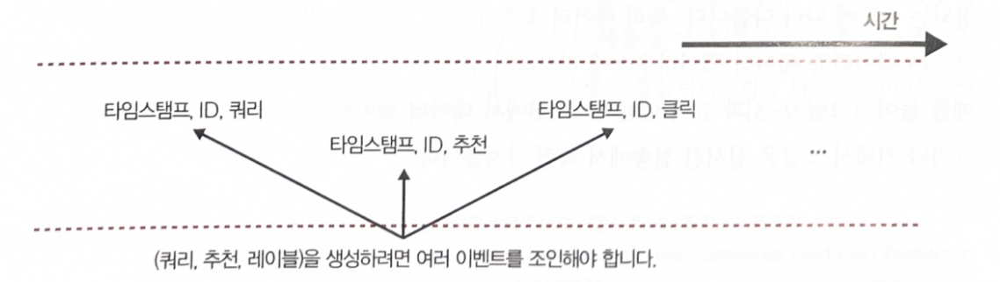

# CH09 연속 학습과 프로덕션 테스트(Continual Learning and Test in Production)

- 연속 학습은 주로 인프라 문제    
- 모델을 얼마나 재훈련 해야하는지, 원하는 만큼 자주 업데이트 하도록    
  인프라를 설정한 후에 재훈련 빈도 고려해야 함     

- 고정 테스트 세트에서 평가하는 것은 충분 x.    
  어렵지만 꼭 필요한 개념인 프로덕션 테스트를 다룸    

- 이 프로세스는 프로덕션에서 라이브 데이터로 시스템을 테스트하는 방법으로,    
  업데이트된 모델이 파괴적인 결과 없이 제대로 작동하는지 확인     

## 9.1 연속 학습     

- '연속학습' 모델이 프로덕션에서 들어오는 모든 샘플로 스스로 업데이트하는    
  훈련 패러다임 생각 -> 하지만 실제로 그렇게 하는 기업 거의 없음     

- 첫쩨, 모델이 신경망이라면 모든 입력 샘플로 학습하면    
  파괴적 망각(catastrophic. forgetting)에 취약해짐     
  파괴적 망각은 신경망이 새로운 정보를 학습할 때  이전에 학습한 정보를    
  갑자기 잊어버리는 경향     

- 둘째, 훈련 비용이 더 많이 듦. 오늘날 백엔드는 대부분 배치 처리를 위해 설계    
  샘플을 하나씩 처리하면 연산 성능이 크게 낭비되고 데이터 병렬 처리를 활용할 수 없음    

- 프로덕션에서 연속 학습을 사용하는 회사는 모델을 마이크로 배치로 업데이트   
  Ex] 데이너 포인트 512개마다 혹은 1024개마다 기존 모델을 업데이트함.    
  각 마이크로 배치의 최적 샘플 개수는 작업에 따라 다름    

- 업데이트된 모델은 평가가 완료될 떄까지 배포 x. 즉, 기존 모델을 직접 변경해선 안됨    
  대신 기존 모델의 복제본을 생성해 신규 데이터로 업데이트하고,    
  업데이트된 복제본이 더 낫다고  판명할 때만 기존 모델을 업데이트된 복제본으로 교체     

  기존 모델을 챔피언(champion) 모델, 업데이트된 복제 모델을 도전자(challenger)   
  실제로 회사에는 동시에 여러 도전자 모델이 있으며 실패한 모델이 있으며    
  실패한 도전자 모델을 다루는 과정은 단순 폐기보다 훨씬 정교    


- 대부분의 회사에서 모델을 자주 업데이트 할 필요가 없다고 주장(이유 2가지)    
  
- 첫째, 재훈련 일정이 타당할 만큼 충분한 트래픽, 즉 충분한 신규 데이터가 없기 때문    

- 둘째, 모델 성능이 그렇게 빨리 떨어지지 않기 때문(필자는 이 의견에 동의)   
  
- 재훈련 일정을 일주일에서 하루로 변경해도 수익이 나지 않고 더많은 오버헤드가 발생한다면   
  모델을 자주 업데이트 할 필요 없음    


### 9.1.1 무상태 재훈련 vs 상태 유지 훈련    

- 연속학습은 재훈련 빈도가 아니라 모델 재훈련 방식과 관련    
  
- 대부분 무상태 재훈련(stateless retraining)을 수행해 모델이 매번 처음부터 훈련   

- 연속 학습은 상태 유지 훈련(stateful training)을 허용함을 의미하며    
  모델은 신규 데이터로  훈련을 지속    

  상태 유지 훈련은 미세 조정(fine-tunning) 혹은   
  중복 훈련(incremental training)이라고 도 함    


- 상태 유지 훈련을 사용하면 더 적은 데이터로 모델을 업데이트    
  모델을 처음부터 훈련하려면 동일한 모델을 미세 조정할 때보다 데이터가 훨씬 많이 필요    

  ex] 모델을 처음부터 다시 훈련하려면 지난 3개월 데이터를 모두 사용해야 할 수 있지만    
  이제 체크포인트에서 모델을 미세 조정하려면 마지막 날 데이터만 사용하면 됨    

- 그럽허브는 상태 유지 훈련을 하면 모델이 더 빠르게 수렴하며   
  필요한 연산 비용도 훨씬 적음을 발견   

  일일 무상태 재훈련에서 일일 상태 유지훈련으로 전환하자   
  훈련 연산 비용이 45분의 1로 감소,  구매율(purchase-through rate) 20% 증가    

- 상태 유지 훈련을 하면 데이터를 완전히 저장하는 일을 피할 수 있음    
  기존 무상태 재훈련에서 데이터 샘플을 모델을 여러번 반복 훈련하는 동안 재사용됨   
  그런데 데이터 저장이 항상 가능하지 않음(특히 개인정보보호 요구사항이 엄격한 경우)   


- 상태 유지 훈련 패러다임에서는 신규 데이터로만 훈련되므로    
  한 데이터 샘플은 훈련에 한 번만 사용   
  즉, 데이터를 영구 스토리지에 저장할 필요 없이 모델 훈련이 이루어지므로 
  개인 정보 보호에 대한 우려 많이 덜음    


- 상태 유지 훈련이 대량의 데이터로 처음부터 훈련하지 않는다는 의미가 아님    
  즉, 신규 데이터로 미세 조정만 수행하지는 않음      
  
  상태 유지 훈련을 가장 성공적으로 적용한 기업에서도 종종 모델을 교정하기 위해    
  대량의 데이터로 처음부터 모델을 훈련함.     
  혹은 상태 유지 훈련과 병행해 모델을 처음부터 훈련하고 파라미터 서버    
  같은 기술을 사용해 업데이트된 두 모델을 결합하기도 함.    

- 인프라가 무상태 재훈련과 상태 유지 훈련을 모두 허용하도록 설정되면    
  훈련 빈도는 쉽게 조정 가능    


- 모델에 신규 피처나 다른 레이어를 추가하고 싶다면 어떻게 작동 ?   
  두가지 모델 업데이트 유형을 구별해야 함    

  - 모델 반복(Model iteration).  
  : 기존 모델 아키텍처에 새로운 피처가 추가되거나 모델 아키텍처가 변경됨     

  - 데이터 반복(Data iteration).  
  : 모델 아키텍쳐와 피처는 동일하게 유지되지만 신규 데이터로 모델을 갱신    


- 오늘날 상태 유지 훈련은 대부분 데이터 반복에 적용   
  
- 모델 아키텍처를 변경하거나 새로운 피처를 추가하려면 모델을 처음부터 훈련해야 함   
  
- 모델 반복의 경우 구글의 'knowledg transfer'와 OpenAI 'model surgery' 같은   
  기법을 사용해 처음부터 훈련을 우회할수 있다는 연구 결과 존재    

  OpenAI에서는 surgery는 선택 프로세스 후에 훈련된 가중치를 한 네트워크에서    
  다른 네트워크로 전송    
  이 포르세슨느 모델에서 어던 부분이 변경되지 않으면 어떤 부분을 다시 초기화해야 하는지   
  결정하기 위함    


***애매한 용어***

- '온라인 학습'이라는 용어 대신 '연속 학습(continual learning)' 용어 사용    

- continuous learning 대신 continual learning 이라는 용어 사용

- continuous learning은 모델이 들어오는 샘플로 지속적으로 학습하는 체제를 의미   

- continual learning에서는 학습이 일련의 배치 혹은 마이크로 배치로 수행   

- cotinuous learning은 때때로 ML의 지속적인 제공(continous delivery(CD))을   
  지정하는데 사용되는데,     
  CD는 continual learning과 밀절합 관련이 있음    

  continuous learning은 기업이 ML 모델의 반복 주기를 가속화하는 데 도움이 됨   
  다만 차이점은 이러한 의미로 사용될떄   
  continuous learning은 CD를 위한 파이프라인 설정에 대한 DevOps 관점   
  continual learning 은 ML 관점에서 사용   


### 9.1.2 연속 학습의 필요성     

- 연속학습은 모델을 업데이트하고 변경 사항을 원하는 만큼 빠르게 배포할 수 있도록   
  인프라를 설정하는 것    

1. 데이터 분포 시프트, 특히 갑자기 발생하는 시프트에 대처하는 일.
   
   Ex] 리프트 같은 승차 공유 서비스의 가격 결정 모델을 구축한다고 가정할때,    
   특정 지역은 역사적으로 목요일 저녁에 운행 수가 적고,    
   따라서 모델이 낮은 운행가격을 예측해 운전자자 운행을 선호 x.    
   그런데 이번 목요일은 저녁에 동네에 큰 행사가 있어 운행 수요가 급증.   
   모델이 이러한 변화에 빠르게 대응할 수 있다면 높은 운행 가격을 예측하고    
   더 많은 운전자를 동원하겠지만,    
   반대로 충분히 빠르게 대응할 수 없다면 탑승하는 승차하기 위해    
   오랫동안 기다려야하고 이는 부정적인 사용자 경험을 유발.       
   심지어 탑승자가 경쟁사 앱을 전환해 수익을 잃을 가능성도 존재.     
 

2. 희귀한 사건(rare event)에 적응하는 것.

  Ex]전자 상거래 웹사이트에서 일한다고 가정.   
  블랙 프라이 데이는 1년에 단 한번 열리는 중요한 쇼핑 이벤트에 해당.    
  하지만 이번 블랙 프라이데이 기간의 고객 행동을 정확하게 예측할 수 있도록    
  모델에 대한 과거 데이터를 충분히 수집할 방법은 없음.     
  성능을 향상시키리면 모델이 하루 종일 신규 데이터로 훈련해야 함.   
  2019년 알리바바는 스트리림 처리 프레임워크인 아파치 플링크의 개발을     
  주도하는 데이터 아티산 팀을 1억 300만 달러에 인수했고,    
  팀은 플링크를 ML 유스 케이스에 적응시키는데 도움을 줌.    
  주요 유스케이스는 미국의 블랙 프라이 데이와 유사한    
  중국 쇼핑 이벤트인 광군제에 더 좋은 추천을 수행하는 것.   
 

3. 오늘날 ML 프로덕션의 주요 난제인 지속 콜드 스타트(continuous cold start)    
   문제에도 도움이 됨.     

   콜드 스타트 문제는 모델이 과거 데이터 없이 신규 사용자를 예측해야 할 때 발생.    
   Ex] 추천 시스템에서 사용자에게 추천을 하기 위해서는 과거 이력을 알아야 함.    
   그러나 해당 사용자가 신규 사용자라면 기록이 없으므로 현재 가장 인기 있는    
   영화같이 일반적인 추천 리스트를 생성해야 함.    

   지속 코드 스타트는 콜드 스타트 문제를 일반화 한 것으로,     
   신규 사용자뿐 아니라 기존 사용자에게도 발생.    
   Ex]기존 사용자가 노트북에서 휴대 전화로 전환하는데 휴대전화에서 동작이   
   노트북에서와 달라서 발생하기도 함.
   사용자가 로그인하지 않아도 발생.    
   뉴스사이트는 대부분 로그인하지 않아도 기사를 읽을 수 있음.  

   Ex] 어떤 사용자가 서비스를 오랫동안 방문하기 않아    
   서비스가 보유한 사용자의 과거 데이터가 오래됐을 때 발생하기도 함.   
   Ex] 호텔과 항공편을 예약하는 경우가 있음.    

- 모델이 충분히 빠르게 조정되지 않으면 사용자 관련 추천 사항을    
  다음번 모델 업데이트까지 제공할 수 없음. 그때쯤이면 사용자들은 자신과    
  관련된 아이템을 찾지 못해 이미 서비스를 떠난 뒤일 수도 있음.    

- 모델을 사용자 방문 세션 내에서 각 사용자에 맞게 조정할 수 있다면 모델을 사용자가    
  처음 방문했을 때도 정확하고 관련있는 예측을 수행할 수 있음.    
  성공한 예로는 틱톡 있으며, 틱톡은 동영상 몇 개만 봐도 틱톡 알고리즘을 통해    
  다음에 보고 싶은 은 것을 높은 정확도로 예측.    
  이는 연속학습이 강력함 예측 잠재력을 발휘할수 있음을 보여줌.    

- 연속학습은 배치 학습의 상위개념.

 

- 전통적인 배치 학습이 할 수 있는 모든 것을 할 수 있으며,    
  게다가 연속 학습은 배치 학습만으로 불가능한 유스 케이스에도 적용이 가능.

 

- 연속학습을 세팅하고 수행하는데 드는 노력과 비용이 배치 학습과 동일하다면      
  연속학습을 수행하지 않을 이유가 없음.    
  다만 아직도 연속학습을 세팅하는데 여전히 어려움이 많이 존재.    
  But 연속학습을 위한 MLOps 도구가 성숙하고 있기에,    
  머지 않은 미래에 배치 학습만큼 쉽게 연속 학습을 설정할 수 있게 될 것.     


### 9.1.3 연속 학습의 난제    

- 주요 난제인 신규 데이터 엑세스, 평가, 알고리즘 다룸    


##### 신규 데이터 엑세스 난제     

- 신규 데이터를 확보하는 일   
  매시간 모델을 업데이트하려면 매시간 새로운 데이터 필요    
  현재 많은 기업이 신규 훈련 데이터를 데이터 웨어하우스에서 가져옴    

  데이터를 가져오는 속도는 신규 데이터가 데이터 웨어하우스에 저장되는 속도에 따라 다름   
  데이터 소스가 여러 개면 속도가 느려질 수 잇음   
  대안으로 데이터를 데이터 웨어하우스에 저장하기 전에 가져오도록 허용하는 방법 존재   

  
  애플리케이션에서 데이터 웨어하우스로 데이터를 전송하는 카프카나 키네시스 같은 실시간   
  전송에서 직접 가져옴    


- 신규 데이터 가져오는 것만으로 충분하지 않음   
  모델 업데이트를 위해 신규 데이터 레이블링를 해야함    

- 많은 애플리케이션에서 데이터를 레이블링하는 속도는 모델 업데이트 속도에   
  병목 현상을 일으킴    

- 연속 학습에 가장 적합한 작업은 짧은 피드백 루프로 자연 레이블을 얻을 수 있는 작업    
  Ex] 동적 가격 책정(예상 수요 및 가용성에 기반함), 도착 시간 추정, 주가 예측,    
  광고 클릭률 예측 및 트위, 노래, 짧은 영상, 기사 등 온라인 콘텐츠에 대한 추천 시스템    

- But 자연 래이블은 곧바로 레이블로 생성 x, 사용자들의 행동 데이터를 기반으로    
  시스템의 로그와 함께 조합해 생성되며, 이를 레이블로 추출    

  시스템은 해당 쿠러ㅣ를 해당 추천사항과 매치하고, 해당 추천 사항은 좋은 추천 사항으로   
  레이블링함    





- 레이블을 추출하기 위해 로그를 다시 살펴보는 프로세스를   
  레이블 계산(label computation)라고 함     

- 로그가 늘어날수록 비용이 높음. 레이블 계산은 배치 처리로 수행할 수 있음    
  
  Ex] 배치 작업을 실행해 로그에서 한번에 모든 레이블을 추출하기 전에 먼저 로그가   
  데이터 웨어하우스 저장되기를 기다림   
  But 데이터가 저장될 때까지 기다렸다가 다음 배치작업이 실행될떄까지 또 기다려야 함   
  

  보다 빠른 접근법은 스트림 처리를 활용해 실시간 전송에서 직접 레이블 추출    

- 레이블링 속도가 모델링 개발 반복에 병목 현상을 일으키는 경우,     
  레이블링 프로세슬르 개선 방법 많음   

- 스노클(Snokel) 같은 프로그래밍 방식 레이블링 도구를 활용해   
  사람의 개입을 최소화하면서 빠르게 레이블을 생성하는 방법이 잇음    

- 크라우드소싱된 레이블를 활용해 신규 데이터에 빠르게 레이블링할 수도 있음    


- 스트리밍 도구 아직 초기단계 비용이 높음, But 발전중    


##### 평가 난제     

- 업데이트를 하기 위해 학습 작성하는 것 x(스르립트 작성하면 Easy).     

- 연속 학습의 가장 큰 난제는 해당 업데이트가 모델을 배포하기에 충분한 수준인지   
  확인하는 일    

- 연속 학습은 파괴적 리스크를 증폭시킴
  (파괴적 리스크 ex 운전자 조종장치(autopilot) 신뢰성)    
  
- (1)모델을 자주 업데이트 할수록 업데이트가 실패할 기회가 많아짐    

- (2) 연속 학습은 모델을 조정된 조작(coordinated manipulation)과   
  적대적 공격에 더 취약하게 만듬      

  모델이 실제 데이터를 사용해 온라인 학습하는 경우, 사용자의 악의적인 데이터   
  입력으로 인해 모델이 잘못된 것을 학습하는 문제가 발생할 수 있음  

  ex) 2016 마이크로소프트에서 출시한 chatbot "Tay".   


- 연속 학습을 위한 평가 파이프라인을 설계할 떄, 평가에는 시간이 걸리며    
  이는 모델 업데이트 빈도에 또 다른 병목 현상외 된다는 점 명심    

  Ex] 대형 온라인 결제 회사에서 이상 거래를 감지하는 ML 시스템    
  이상 거래 패턴은 빠르게 변하므로 회사에서는 변화하는 패턴에 적응하도록   
  시스템을 빠르게 업데이트하려고 함     
  But, 해당 작업 데이터 레이블의 불균형 떄문에 어떤 모델이 더 나은지    
  정확히 평가하는 데는 약 2주가 걸림   
  그래서 해당 회사는 2주에 한번만 업데이트 함    

##### 알고리즘 난제     

- 알고리즘 난제는 신규 데이터 난제와 평가 난제에 비해 가벼운 문제    

- 알고리즘은 특정 알고리즘과 특정 훈련 빈도에만 영향을 미침   
  정확히는, 매우 빠르게 업데이트하고자 하는 행렬 기반 모델과    
  트리 기반 모델에만 영향을 줌    

- 2가지 모델 하나는 신경망 하나는 협업 필터링(colloborative filtering 모델과   
  같은 행렬 기반 모델   
  형업 필터링 모델은 사용자-아이템 행렬(user-item matrix)과 같은 차원 축소 기술 사용  

  신경망 모델은 임의 크기의 데이터 배치로 업데이트할 수 있으며 심지어 단 하나의 데이터   
  샘플로도 업데이트 단계를 수행할 수 있음. 반면에 협업 필터링 모델을 업데이트하려면   
  차원 축소를 수행하기에 앞서 전체 데이터셋을 사용해 사용자-아이템 행렬을 구축해야 함   

  물론 신규 데이터 샘플로 행렬을 업데이트할 때마다 행렬의 차원 축소를 적용할 수 있지만.  
  행렬이 크면 차원 축소 단계가 너무 느려 자주 수행하기에는 비용이 높다.    

  따라서 부분 데이터셋으로 학습하는 경우에는 협업 필터링 모델모다 신경망 모델이 적합   

  연속 학습 패러다임에는 행렬 기반 모델이나 트리 기반 모델보다 신경망 같은 모델을    
  적용하는 편이 더 쉬움    
  물론 중복 데이터로 학습하는 트리 기반 모델도 존재     
  호에프딩 트리(Hoeffding Tree)와 그 변형인 호에프딩 윈도 트리(Hoeffding Window Tree) 및   
  호에프딩 적응 트리(Hoeffding Adaptive Tree)    
  다만 이 모델들은 아직 널리 사용 x.  

- 학습 알고리즘뿐 아니라 피처 추출 코드도 부분 데이터셋과 함께 작동해야 함   
  5.2.2절 '스케일링'에서 나오듯 최솟값, 최댓값, 중앙값, 분산과 같은 통계량을 사용해   
  피처를 확장해야 하는 경우 많음   
  이러한 통계량을 계산하려면 전체 데이터셋을 살펴봐야 함   
  
- 다만 모델이 한번에 작은 데이터 부분 집합만 본다면 이론상 데이터의 각 부분 집합에 대한    
  통계량을 계산 가능   
  But, 이는 통계량이 부분 집합에 따라 크게 다름을 의미      
  한 부분 집합으로 계산한 통계량은 다른 부분 집합과 크게 다르므로,    
  한 부분 집합으로 훈련한 모델을 다른 부분집합으로 일반화하기 어려움     


- 서로 다른 부분 집합 간에 통계량을 안정적으로 유지하려면 통계를 온라인으로 계산하는 편이 좋음    

- 모든 데이터의 평균이나 분산을 한번에 사용하는 대신 신규 데이터를 볼 떄마다 통계량을 점진적으로    
  계산하거나 근사합니다.    

- 논문 [Optimal Quantile Approximation in Streams]에서는 이러한 알고리즘을 설명   
  
- 프레임워크들에서는 구간 통계(running statistics)를 계산하는 기능 일부 제공   
  ex] scikit-learn의 StandardScaler에는 구간 통계과 함께 피처 스케일러를 사용한느    
  partial_fit 메서드가 있음   
  다만 프레임워크의 내장 메서드는 속도가 느리며 구간 통계를 폭넓게 지원하지 않음    


### 9.1.4 연속 학습의 네 단계     

- 연속 학습으로 전환하는 과정은 다음처럼 네 단계로 이뤄짐    


#### 1단계: 수동 무상태 재훈련     
- ML 팀은 초기에는 가능한 한 많은 비즈니스 문제를 해결하기 위해  ML 모델 개발에   
  주력함   

  ex] 전자 상거래 웹사이트 회사에서  다음 네 가지 모델을 차례로 개발   
  ```
  1. 이상 거래를 탐지하는 모델    
  2. 사용장에게 관련 상품을 추천하는 모델    
  3. 판매자가 시스템을 악용하는지 예측하는 모델   
  4. 주문 건을 배송하는 데 걸리는 시간을 예측하는 모델
  ```

- 신규 모델 개발에 집중하므로 기존 모델을 업데이트 하는 일은 뒷전    

- 다음 두 가지가 충족될 때만 모델을 업데이트 함.   
  1. 모델 성능이 가져오는 득보다 실이 클 경우   
  2. 팀에서 모델을 업데이트할 시간이 있을 때     

 

- 업데이트 주기는 모델마다 다르며, 어떤 모델은 6개월에 한번    
  어떤 모델은 분기에 한번 어떤건 1년동안 안하기도 함     

 

- 모델 업데이트 프로세스는 수동이며 임시방편적(ad-hoc)임.    

 
- 누군가는 데이터 웨어하우스에 신규 데이터를 쿼리힘.     
  또 다른 사람이 신규 데이터를 정제하고, 데이터에서 피처를 추출하고,    
  이전 데이터와 신규 데이터 모두를 사용해 처음부터 모델을 재훈련한 다음     
  업데이트된 모델을 이진 포팻으로 내보냄.     
  그러면 또 다른 사람이 해당 이진 포맷을 사용해 업데이트된 모델을 배포함.     

- 종종 데이터, 피처, 모델 로직을 캡슐화하는 코드가 재훈련 과정에서 변경되며,    
  변경사항이 프로덕션에 복제되지 않아 추적하기가 어려운 버그가 발생하기도 함.      

- 기술 산업에 속하지 않는 대다수 기업, 예컨대 ML을 도입한 지 3년 미만이고    
  ML 플랫폼 팀이 없는 기업들이 해당 단계에 해당함.     


#### 2단계: 자동 재훈련     

- 몇년 후 ML 팀에서는 모델 몇 개를 배포하는데 성공했고,    
  이 모델들은 명백한 문제를 대부분 해결함.    

- 프로덕션에 적용된 모델을 5개에서 10개 사이. 이때부터는 새로운 모델을 개발하기보다    
  기존 모델을 유지하고 개선하는 일이 우선. 1단계에서 언급한 임시방편적이고    
  수동적인 업데이트 프로세스는 무시하기에는 너무 큰 골칫거리.     
  따라서 팀에서는 모든 재훈련 단계를 자동으로 실행하는 스크립트를 작성하기로 함.    
  작성한 스크립트는 스파크 같은 배치 프로세스를 사용해 주기적으로 실행됨.    

- 어느 정도 성숙한 ML인프라를 갖춘 기업들은 대부분 이 단계에 있음.    
  일부 정교한 기업에서는 최적의 재훈련 빈도를 결정하기 위해 실험을 실행하지만   
  대부분은 재훈련 빈도를 실무자의 직감을 기반으로 설정.     

- 재훈련 프로세스를 자동화하는 스크립트를 생성할 때는    
  시스템 내에 있는 각 모델마다 필요한 재훈련 일정이 다르다는 점을 고려해야 함.   
  또한 모델 간에 종속성이 있으면 자동화 스크립트가 훨씬 복잡해짐.    


***요구사항***

프로덕션에 적용된 ML 모델이 있는 회사라면    
자동 재훈련에 필요한 인프라를 대부분 보유하고 있음.    
이 단계의 실행 가능성은 스크립트 작성의 실행 가능성을 중심으로 하며,    
이때 스크립트는 워크 플로를 자동화하고,     
다음 작업을 자동으로 수행하도록 인프라를 구성.

 
1. 데이터를 가져옵니다.   
2. 필요시 데이터를 다운샘플링하거나 업샘플링합니다.    
3. 피처를 추출합니다.    
4. 레이블링 작업과 그에 대한 처리를 수행해 훈련 데이터를 생성합니다.    
5. 훈련 과정을 시작합니다.    
6. 새로 훈련한 모델을 평가합니다.    
7. 모델을 배포합니다.     


- 스크립트를 작성하는데 걸리는 시간은    
  스크립트 작성자의 역량을 비롯한 여러 요인에 따름.     

- 스크립트의 실행 가능성에 영향을 미치는 주요 요소 세 가지.     

 
1. 스케줄러
  작업 스케일링을 처리하는 도구.  스케줄러가 없다면 이를 설정하는데 시간이 필요합.   
  But 에어플로(Airflow)나 아고(Argo) 같은 스케줄러가 이미 있다면 스크립트를 연결하기가 그리 어렵지 않음.     

2. 데이터의 가용성과 접근성    
  데이터를 데이터 웨어하우스에 직접 수집해야 하나요?   
  여러 조직의 데이터를 결합해야 하나요?   
  처음부터 많은 피처를 추출해야 하나요?   
  데이터 레이블링도 해야 하나요?    
  ' 예' 라고 답하는 질문이 많을수록 스크립트를 설정하는 데 드는 시간이 많음.    

3. 모델스토어     
  모델 스토어로 모델을 재현하는데 필요한 모든 아티팩트를 자동으로 버전화하고 저장.   
  가장 간단한 모델 스토어는 구조화된 방식으로 직렬화된 모델 개체를 저장하는 S3 버킷.    
  다만 S3 같은 개체 스토리지는 아티팩트 버전 관리에 좋지 않으며 사람이 읽을수 없음.   
  따라서 관리형 서비스인 아마존 세이지메이커나 오픈 소스인 데이터브릭스 ML플로같이 보다 성숙한 모델 스토어가 필요.    
 
***피처 재사용(Log and wait)***   

추출된 피처를 모델 재훈련에 재사요해 계산 비용을 절약하고 예측과 훈련 간의 일관성을 갖게 함    
이 접근법이 바로 "Log and wait".    
이는 훈련-서빙 편향을 줄이는 고전적 접근법(8.1.2 머신러닝 한정 장애)의 '프로덕션 환경 데이터가    
훈련 데이터와 다른 경우 참조)    

"Log and wait" 점점 대중화되고 있음    
페어(Faire)의 데이터 과학자 샘 케니(Sam Kenny) 작성한 블로그글 참고   


#### 3단계: 자동 상태 유지 훈련      

- 2단계에서는 모델을 재훈련 할 때 매번 처음부터 모델을 훈련(무상태 재훈련).     
  따라서 재훈련 비용이 높으며 재훈련 빈도가 높다면 특히 비용이 많이 듬.    


- 이 단계에서는 자동 업데이트 스크립트는 재구성함. 모델 업데이트가 시작되면 현재 체크포인트에 대한 훈련을    
  계속하기에 앞서 이전 체크포인트를 찾아 메모리에 올림.   


 

##### <요구사항>

- 이 단계에서 가장 필요한 것은 사고방식 변화.    

- 보통 모델을 처음부터 훈련하는 것이 일반적이라고 생각하는데, 이는 많은 기업에서 데이터 과학자가 매번 처음부터 모델을 훈련하고    
  엔지니어에게 전달해 배포하는 데 너무 익숙해졌기 때문. 그렇기에 상태 유지 훈련이 가능하도록 인프라를 설정하는 것은 고려하지 않음.    

- 일단 상태 유지 훈련에 전념하면 업데이트 스크립트를 재구성하는 일은 간단함.    

- 이 단계에서 가장 필요한 것은 데이터 및 모델 계보를 추적할 방법.     

  먼저 모델 버전 1.0을 업로드 한다고 상상했을 때, 이 모델을 신규 데이터로 업데이트해 모델 버전 1.1을 생성하고,    
  마찬가지로  업데이트해 모델 1.2를 생성. 이제 또 다른 모델을 업로드하고 모델 버전 2.0이라고 부름.        
  이 모데을 신규 데이어로 업데이트해 모델 버전 2.1을 생성. 이런 식으로 다양한 모델 버전이 생성됨.     
 

- 모델을 재현하고 디버깅하기 위해서는 모델이 시간에 따라 어떻게 발전하는지,    
  어떤 모델이 기본 모델로 사용됐는지, 업데이트에 어떤 데이터를 사용했는지 등의 정보가 필요함.       
  이때, 기존 모델 스토어에는 모델 계보 기능이 없으므로 사내에서 솔루션을 구축해야 합니다.   

 
- 데이터 웨어하우스 대신 실시간 전송에서 데이터를 가져오려는데 스트리밍 인프라가    
  충분히 성숙하지 않았다면 스트리밍 파이프라인을 변경하는 과정이 필요함.    


#### 4단계: 연속 학습     
- 3단계에서는 모델이 개발자가 설정한 일정에 따라 계속 업데이트됨.    
  최적의 일정은 찾기가 간단하지 않으며 상황에 따라 달라짐.   

- 따라서 업데이트 일정을 고정하는 대신 데이터 분포가 변하고 모델 성능이 떨어질 때마다    
  모델이 자동으로 업데이트 되도록 함.    

 

- 최종 목표는 연속학습과 에지 배포를 결합할 때.

 
- 기존 모델을 신규 디바이스에 배포한다고 가정 시.
  디바이스에 있는 모델은 중앙 집중식 서버와 동기화 할 필요 없이 환경에 따라 지속적으로 업데이트하고 적응.  
  물론 중앙 집중식 서버 비용도 발생하지 않음.게다가 디바이스와 클라우드 간에 데이터를 주고 받을 필요가 없으므로    
  데이터 보안 및 개인 정보 보호 기능이 향상됨.    

 

##### <요구사항>     

- 3단계에서 4단계로 넘어가는 과정은 험난함.    
  먼저 모델 업데이트를 트리거하는 메커니즘이 필요함.    
 

- 트리거

```
시간 기반 : 예컨대 5분마다 업데이트합니다.
성능기반 : 예컨데 모델 성능이 떨어질때마다 업데이트합니다.
볼륨 기반 : 예컨에 레이블링된 데이터 총량이 5% 증가할 때마다 업데이트 합니다.
드리프트 기반 : 예컨대 주요 데이터 분포 시프트가 감지될 때마다 업데이트 합니다.
 
```

- 이 트리거 메커니즘이 작동하려면 견고한 모니터링 솔루션이 필요함.   
  모델 업데이트 함수를 작성하는 것은 3단계와 크게 다르지 않음.    
  다만 업데이트된 모델이 제대로 작동하는지 확인하는 것은 어려운 부분.    
  따라 프로덕션에서 테스트르 통해 이를 확인함.    

 


## 9.1.5 모델 업데이트 빈도     

- 모델을 신규 데이터로 업데이트했을 때 성능이 얼마나 향상되는지 파악해야 함.    
  성능이 크게 향상될수록 더 자주 재훈련해야함.     

#### 신규 데이터의 가치    
- 업데이트가 모델 성능을 얼마나 향상하는지 파악하면 업데이트 빈도를 결정하는 문제가 훨씬 쉬워짐.   


- 성능 향상을 파악하는 한 가지 방법은 과거 여러 시간대의 데이터로 모델을 훈련하고   
  현재 시점 데이터로 평가해 성능이 어떻게 변하는지 확인하는 것.    

 
- 2020년 데이터가 있다고 가정.

 

- 신규 데이터의 가치를 측정하기 위해
  2020년 1월부터 6월까지의 데이터로 모델 A를 훈련하고, 4월부터 9월까지의 데이터로 모델B를 훈련하고,
  6월부터 11월까지의 데이터로 모델 C를 훈련함. 그리고 12월 데이터로 각 모델을 테스트.

 

- 모델별 성능 차이를 통해 모델이 최신 데이터를 통해 얻는 성능 향상을 파악.   
  3개월전 데이터로 훈련된 모델이 1개월 전 데이터로 훈련된 모델보다   
  훨씬 나쁘다면 모델을 3개월보다는 자주 재훈련.   

- 실제로는 실험을 훨씬 세분화해 몇 달이 아니라 몇 주, 며칠, 심지어 몇시간 또는 몇 분안에 실행할 수도 있음.      

 

- 2014년 페이스북은 광고 클릭률 예측과 관련해 유사한 실험을 수행해,    
  주간 재훈련에서 일일 재훈련으로 전환하면 모델 손실이 1% 줄어든다는 사실을 발견함. 이는 페이스북에 상당하 성능 향상으로,   
  재훈련 파이프라인 주기를 매주에서 매일로 전환하는 결과로 이어짐.    

 

- 오늘날은 온라인 콘텐츠가 훨씬 다양하고 사용자의 관심도 훨씬 빠르게 변한다는 점을 고려하면    
  광고 클릭률에 대한 신규 데이터의 가치는 보다 높다고 예상할 수 있음.    

 

- 정교한 ML 인프라를 갖춘 회사는 재훈련 파이프라인 주기를 몇 분 단위로 전환할 만큼 충분한 성능 향상을 발견. 

 

#### 모델 반복 vs. 데이터 반복
- 앞 부분에서 모든 모델 업데이트가 동일하지 않다고 언급했으며   
  모델 반복 (기존 모델 아키텍처에 신규 피처를 추가하거나 모델 아키텍처를 변경함)과   
  데이터 반복 (모델 아키텍처와 피처는 동일하지만 모델을 신규 데이터로 갱신함) 을 구별함.   

- 이론상 두 가지 유형을 모두 수행할 수도 있으며,   
  실제로는 때때로 두 가지 업데이트를 모두 수행해야 함.   
  다만 한 가지 접근법에 자원을 많이 사용할수록 다른 접근법에 사용할 수 있는 자원은 줄어듬.   

 

- 데이터 반복으로도 성능이 크게 향상되지 않는다면 더 나은 모델을 찾는 데 자원을 사용해야 함.   
  반면에 더 나은 아키텍처를 찾기 위해 연산 자원을 100배 사용하는 성능이 단 1%만 향상되는 한편,   
  지난 3시간 데이터로 동일 모델을 업데이트하기 위해 연산 자원을 1배만 사용하고 성능이 똑같이 1% 향상된다면 어떻게 해야할까.   
  그렇다면 데이터를 반복하는 편이 좋음.    


- 아마도 가까운 미래에 우리는 어떤 상황에서 어떤 접근법이 잘 통할지 더 이론적으로 이해하게 될 것.   
  But 현재로서는 어떤 책도 특정 작업의 특정 모델에 어떤 접근법이 더 잘 맞는지에 대한 답을 줄 수 없음.    
  이를 알아내려면 실험을 수행해야 함.     

 

- 모델 업데이트 빈도에 대한 질문은 대답하기 여려운 문제.    
  But 인프라가 초기 단계이고 모델 업데이트 프로세스가 수동인데다 느리다면 답은 '가능한 자주 업데이트 하기'.

 

- 한편 인프라가 성숙하고 모델 업데이트 프로세스가 부분적으로 자동화됨에 따라   
  모델 업데이트는 몇 시간 만에 완료될 수 있음. 따라서 모델 업데이트 주기는 최신 데이터를 통해 성능이 얼마나 향상되는지에 따라 다름.    
  모델에 대한 신규 데이터의 가치를 정량화하기 위해 실험을 수행하는 것이 중요.      

 

## 9.2 프로덕션에서 테스트하기     

- 모델을 충분히 평가하려면 오프라인 평가와 온라인 평가를 혼합이 필요.      

 

- 왜 오프라인 평가만으로 충분하지 않은지 오프라인 평가의 주요 테스트 주형인 테스트 분할과 백테스트를 살펴보며 알아봄.   

 

- 테스트 분할
  오프라인에서 모델을 평가하는데 사용하는 고전적인 유형 중 하나.      
  테스트 분할은 일반적으로 정적.    
  여러 모델을 비교하기 위해 신뢰된 벤치마크를 수행하려면 테스트 세트가 동일해야함.    
  두 모델을 서로 다른 세트에서 테스트하면 그 결과를 비교하기 어려움.   
 

- 백테스트
  과거 특정 기간의 데이터로 예측 모델을 테스트하는 방법.   
  모델을 신규 데이터 분포에 맞게 업데이트하는 경우 신규 모델을 이전 분포의 테스트 분할에서 평가하는 것으로는 충분하지 않음.    
  데이터가 최신일수록 현재 분포에서 추출될 가능성이 더 높다고 가정할 때,    
  한 가지 아이디어는 액세스할 수 있는 가장 최근 데이터로 모델을 테스트하는 것.    
  따라서 직전 일자의 데이터로 모델을 업데이트한 후 직전 1시간의 데이터로 모델을 테스트.     
  

- 백테스트가 정적 테스트 분할을 대체하기에는 충분하지 않음.    
  만약 데이터 파이프라인에 문제가 발생해 최근 1시간 데이터 중 일부가 손상된 경우,    
  이 최근 1시간 데이터 만으로 모델을 평가하는 것으로는 충분하기 않기 때문.    

  백테스트를 사용하더라고 새너티 체크를 통해 반복적으로 사용해 잘 파악된,    
  신뢰하는 정적 테스트세트로 모델을 평가해야함. 데이터 분포는 시간에 따라 변화할 수 있으므로,    
  모델이 지난 시간의 데이터로 잘 작동한다고 해서 향후 데이터로 계속해서 잘 작동한다는 의미는 아님.    

 

모델이 프로덕션 환경에서  잘 작동하는지 알 수 있는 유일한 방법은 모델 배포(Deploy).   


 

#### 9.2.1 섀도 배포(shadow deployment).   
모델 혹은 소프트웨어 업데이트를 배포하는 가장 안전한 방법     

작동 순서    
```
1.기존 모델과 병렬로 후보 모델을 배포.
2.들어오는 요청을 두 모델로 라우팅해 예측하되 기존 모델의 예측 결과만 사용자에게 제공.
3.분석을 위해 새 모델의 예측 결과를 기록.
4.새 모델의 예측 결과가 만족스러울 때만 기존 모델을 새 모델로 교체.
```

새 모델의 예측 결과가 만족스러운지 확인하기 전까지 예측 결과를 사용자에게 제공 x.   
새 모델이 튀는 작업을 수행할 위험도가 적어도 기존 모델보다는 높지 않습니다.    
비용이 높음. (시스템이 생성하는 예측 개수가 두 배이므로 추론 연산 비용도 두 배 증가)     
 

#### 9.2.2 A/B 테스트     
한 객체(object)의 두 가지 변형(variant)을 비교하는 방법.      
일반적으로 두 변형에 대한 응답을 테스트하고 둘 중 어느 것이 더 효과적인지 결정.     
ML에서는 기존 모델이 하나의 변형이고 후보 모델이 또 다른 변형.      
A/B 테스트를 사용해 사전 정의된 몇 가지 지표에 따라 어떤 모델이 더 나은지 판단.    
A/B 테스트는 2017년 기준 마이크로소프트나 구글 같은 회사에서 연견 1만 건 이상 수행할 정도로 널리 보급됨.      
ML 엔지니어들은 프로덕션에서 ML 모델을 평가하는 방법으로 A/B 테스트를 첫 번째로 선택함.    
 

작동 순서     
```
1. 기존 모델과 함께 후보 모델을 배포.
2. 트래픽 중 일정 비유을 새 모델로 라우팅하고 나머지 트래픽을 기존 모델로 라우팅함.   
   일반적으로 두 변형이 동시에 예측 트래픽을 처리하지만 때때로 한 모델의 예측 결과가 다른 모델의 예측 결과에 영향을 미치기도 함.   
   Ex] 승차 공유의 동적 가격 책정에서 모델의 예측 가격을 가용한 운전자 및 탑승자 수에 영향을 미치며,    
   이는 차례로 다른 모델의 예측에 영향을 미침. 이럴 때는 변형을 번갈아 실행해야 함.      
   Ex, 하루는 모델 A를 서빙하고 다음 날은 모델 B를 서빙합니다.    
3. 두 모델의 예측 결과와 사용자 피드백을 모니터링하고 분석해 두 모델의 성능 차이가 통계적으로 유의한지 확인.     
```

A/B 테스트를 올바르게 수행하기 위한 고려사항 두 가지.     
1. A/B테스트는 무작위 실험으로 구성됨. 이때 각 모델로 라우팅되는 트래픽은 무작위여야 하며    
   그러지 않으면 테스트 결과는 무효가 됨.    

   Ex, 트래픽을 두 모델로 라우팅하는 방식에 선택 편향이 있다고 가정 시,    
   모델 A에 노출된 사용자는 일반적으로 휴대 전화를 사용하고     
   모델 B에 노출된 사용자는 일반적으로 데스크톱을 사용. 모델 A의 정확도가    
   모델 B보다 높으면 그 이유가 모델 A가 모델 B보다      
   우수해서인지 혹은 '휴대 전화 사용'이 예측 품질에 영향을 미쳐서인지 알 수 없음.  

2. A/B테스트 결과가 충분한 신뢰도를 얻으려면 테스트가 실행되는 샘플 개수가 충분해야 함.       


- 이때 A/B테스트 결과가 한 모델이 다른 모델보다 낫고 그 차이가 통계적으로 유의미함을 보여준다면    
  둘 중 어느 모델이 실제로 나은지 결정할 수 있음.    

- A/B테스트는 통계적 유의성을 측정하기 위해 2-표본 검정 같은 통계적 가설 테스트를 사용.    

- 2-표본 검정을 두 모집단 간의 차이가 통계적으로 유의한지 확인하는 검정 방법. 분포 시프트 유스 케이스에서,    
  통계적 차이가 두 모집단이 서로 다른 분포에서 왔음을 시사한다면 이는 원래 분포가 시프트했다는 의미임.    


- A/B테스트 유스 케이스에서 통계적 차이는 한 변형이 다른 변형보다    
  우수함을 보여주기에 충분한 증거를 수집했음을 의미.    

- 다만 통계적 중요성은 유용하지만 완벽하지는 않음.    

- Ex, 2-표본 검정을 실행해 p-value가 p=0.05 혹은 5%로 모델 A가 모델 B보다 낫다는 결과를 얻었고,   
  통계적 유의성을 P <= 0.5로 정의한다고 가정 시. 즉, 동일한 A/B테스트 실험을 여러번 실행하면 그중 95%는 A가 B보다 우수하고,    
  나머지는 5%는 B가 A보다 우수. 따라서 결과가 통계적으로 유믜하더라도 실험을 다시 실행하면 다른 모델을 선택하게 될 가능성이 있음.    


- 그렇지만 A/B 테스트 결과가 통계적으로 유의하지 않더라도 A/B가 테스트가 실패한 것은 아님.        
  많은 샘플로 A/B테스트를 실행했는데 두 모델의 차이가 통계적으로 유의하지 않다면,       
  두 모델 간에 큰 차이가 없을 수 있으며 두 모델 중 어느 것을 사용해도 괜찮음.    

- 또한 프로덕션 환경에 후보 모델이 하나가 아닌 여러 개일 때가 많음.   
  변형을 2개 이상 사용해 A/B 테스트를 수행할 수 있음.    
  즉, A/B/C 테스트나 A/B/C/D 테스트를 수행하는 것도 가능.    


#### 9.2.3 카나리 배포(Canary Release).         
신규 소프트 웨어 버전을 프로덕션 환경에 도입할 때 위험을 줄이는 기술.     
변경사항을 전체 인프라에 롤아웃해 모든 사용자가 사용하도록 하기 전에 소수의 사용자에게 천천히 롤 아웃.  
후보 모델 성능은 관심있는 지표를 기준으로 기존 모델 성능과 비교해 측정됩니다.    
후보 모델의 주요 지표가 크게 저하되면 카나리 배포가 중단되고 모든 트래픽이 기존 모델로 라우팅됨.    
카나리 배포는 A/B테스트와 설정이 유사해 A/B테스트를 수행하는데 적용할 수 있음.    
다만 A/B테스트 없이도 카나리 분석을 수행할 수 있음.    
Ex],트래픽을 각 모델로 라우팅하기 위해 무작위화할 필요가 없음.    
카나리 배포의 예 중 하나는 후보 모델을 모두에게 롤아웃하기 전에    
덜 중요한 시장에 먼저 롤아웃하는 것이 있음.    
 

작동 순서     
```
1.기존 모델과 함께 후보 모델을 배포합니다. 후보모델을 카나리라고 함.      
2.일부 트래픽을 후보 모델로 라우팅.    
3.성능이 만족스러우면 후보 모델이 라우팅하는 트래픽을 늘림.    
  성능이 만족소럽지 않다면 카나리를 중단하고 모든 트래픽을 기존 모델로 다시 라우팅함.    
4.카나리가 모든 트래픽을 처리하거나 카나리가 중단되면 중지.    
```

#### 9.2.4 인터리빙 실험     

- 사용자를 한 가지 모델의 추천 사항에 노출하는 대신,    
  두 모델의 추천 사항에 노출하고 어느 모델을 추천 사항을 클릭하는지 확인하는 방법.    
  해당 방법을 통해 넷플릭스는 실험을 통해 인터리빙이    
  "기존 A/B 테스트에 비해 훨씬 적은 샘플로 최상의 알고리즘을 안정적으로 식별한다"는 것을 발견.    

- A/B테스트에서는 리텐션과 스트리밍 같은 핵심 지표를 측정하고 두 그룹 간의 결과를 비교함.    
  한편 인터리빙에서는 실제 사용자 선호도를 측정해 두 알고리즘을 비교함.    
  인터리빙 결과는 사용자 선호도에 따라 결정되지만, 사용자 선호도가 더 나은 핵심 지표로 이어진다는 보장은 없음.    

- 또한 사용자에게 여러 모델의 추천 사항을 표시할 때 추천 사항의 위치가 클릭 여부에 영향을 미친다는 점에 유의해야 함.   
  Ex] 사용자는 아래쪽에 있는 추천 사항보다 위쪽에 잇는 추천 사항을 클릭할 가능성이 훨씬 높음.    
  인터리빙으로 유효한 결과를 얻으려면 특정 위치 A에서 생성될 가능성과 B에서 생성될 가능성이 동등해야 함.     
  이를 보장하기 위해 사용하는 한 가지 방법은, 스포츠의 드래프트 프로세스를 모방하는 팀-드래프트 인터리빙임.   
  각 추천 위치마다 A 혹은 B를 동일한 확률로 무작위로 선택하고,    
  선택된 모델은 아직 선택되지 않는 최상위 추천 사항을 선택.    
  

#### 9.2.5 밴딧
 
- 밴딧(bandit) 알고리즘은 도박에서 유래. 카지노에는 지급액이 각기 다른 여러 슬롯머신이 있음.    
  슬롯머신은 원 암드 밴딧이라고도 하므로 그 이름을 따왔음.     
  어느 슬롯머신이 가장 높은 보상을 주는지도 모름.    
  따라서 여러 번 시험을 통해 슬롯머신의 보상을 최대화하는 동시에 어떤 슬롯머신이 가장 좋은지 알아냄.    


- 멀티 암드 밴딧은 활용과 탐색 사이에서 균형을 맞추는 알고리즘.     

 

- 현재 프로덕션에서 모델 테스트에 사용하는 표준 방법은 A/B테스트.    
  A/B테스트를 사용하면 예측을 위해 트래픽을 각 모델에 무작위로 라우팅하고,    
  시행이 끝나면 어느 모델이 더 잘 작동하는지 측정. A/B 테스트는 무상태 테스트라고 불리는데,    
  테스트 중간 과정에서 성능을 고려하지 않고 각 모델로 트래픽을 라우팅하기 때문.   
  A/B 테스트는 배치 예측으로도 수행할 수 있음.    

 

- 평가할 모델이 여러 개일 때 각 모델은 보상을 모르는 슬롯머신처럼 생각할 수 있음.    
  밴딧을 사용하면 예측을 위해 트래픽을 각 모델로 라우팅해 최상의 모델을 결정하는 동시에,    
  사용자에 대한 예측 정확도를 최대화하는 방법을 결정. 밴딧은 상태 유지.     
  요청을 모델로 라우팅하기 전에 모든 모델의 현재 성능을 계산해야 하는데 이때 다음 세가지가 필요.

 

1. 모델이 온라인 예측을 수행할 수 있어야 함.    
2. 짧은 피드백 루프가 바람직함. 즉, 예측이 좋은지 아닌지에 대한 피드백을 받아야 함.    
   추천 사항처럼 사용자 피드백으로 레이블을 결정하는 작업이 보통 이에 해당됨.    
   사용자가 추천 사항을 클릭하면 그것이 좋은 것으로 간주.     
   피드백 루프가 짧으면 각 모델의 보상을 빠르게 업데이트할 수 있음.     
3. 피드백을 수집하고, 각 모델 성능을 계산 및 추적하고, 현재 성능을 기반으로    
   다른 모델에 예측 요청을 라우팅하는 메커니즘이 필요.     
 

- 밴딧은 학계 연구를 통해 A/B 테스트보다 훨씬 더 데이터 효율적인 것으로 나타남.    
  밴딧은 어떤 모델이 가장 좋은지 결정하는 데 필요한 데이터가 적으며 트래픽을    
  더 나은 모델로 더 빨리 라우팅하므로 기회비용을 줄여줌.    

 

- 구글의 그렉 래퍼티가 실험한 바에 따르면 A/B 테스트에서는 95%의 신뢰 구간을 얻으려면    
  샘플이 63만 개 필요했지만, 간단한 밴딧 알고리즘은 1만 2,000개 미만의 샘플로 한 모델이    
  다른 모델보다 5% 더 우수함을 결정.     

 

- 다만 밴딧은 A/B 테스트보다 훨씬 구현하기 어려움.    
  계산이 필요하며 모델 결과를 추적해야 하기 때문. 따라서 밴딧 알고리즘은    
  몇몇 빅테크 회사를 제외하고는 업계에서 널리 사용되지 않음.     

 

#### 탐색 전략으로서의 컨텍스트 밴딧      
- 모델 평가를 위한 밴딧이 각 모델의 보상을 결정한다면, 컨테스트 밴딧은 각 행동의 보상을 결정.    
  추천 및 광고에서 행동은 사용자에게 보여줄 아이템 및 광고이며     
  사용자가 클릭할 확률이 얼마나 되는지에 따라 보상이 결정됨.    
  컨텍스트 밴딧은 다른 밴딧과 마찬가지로 모델의 데이터 효율성을 향상하는 놀라운 기술.    

 
- 추천할 아이템이 1,000개인 추천 시스템을 구축한다고 가정 시, 이는 1,000개 암드 밴딧 문제가 됨.    
  매번 사용자에게 가장 관련성이 높은 상위 10개 아이템만 추천해야 한다고 가정.    
  밴딧 관점에서 보면 최고의 무기 10개를 선택해야함.    
  표시된 아이템은 사용자 클릭 여부로 추론한 사용자 피드백을 받음.    
  다만 나머지 990개 아이템에 대한 피드백은 받지 않음.    
  이를 부분 피드백(partial feedback) 문제 혹은 밴딧 피드백(bandit feddback) 이라고 함.    
  컨텍스트 밴딧을 밴딧 피드백의 분류 문제로 생각할 수도 있음.     

 

- 사용자가 아이템을 클릭할 때마다 이 아이템의 가치 점수 1점을 얻는다고 가정해봄.    
  아이템의 가치 점수가 0점이면 아이템이 사용자에게 표시되지 않았거나, 표시됐지만 클릭되지 않았기 때문.    
  사용자에게 가장 가치가 높은 아이템을 보여주고자 하지만, 가장 가치가 높은 아이템만 계속 보여주면   
  같은 인기 아이템을 계속 추천하게 되며, 한 번도 보여주지 않은 아이템을 가치 점수가 0점에 머물게 됨.    


- 컨텍스트 밴딧 알고리즘은 사용자가 좋아할 아이템을 보여주는 것과 피드백을 원하는 아이템을     
  보여주는 것 사이에서 균형을 유지하는데 도움이 됨.     
  이는 강화 학습에서 접한 탐색-활용 트레이드오프와 동일.     

 

- 컨텍스트 밴딧은 '원-샷' 강화 학습 문제라고도 함.    
  강화 학습에서는 보상을 받기 전에 일련의 행동을 수행해야 하지만,    
  컨텍스트 밴딧은 행동 직후에 밴딧의 피드백을 받음.     
  Ex] 광고를 추천한 후 사용자가 해당 추천을 클릭했는지에 대한 피드백을 받음.     


- 컨텍스트 밴딧은 오랫동안 연구됐으며 모델 성능을 크게 향상하는 것으로 나타냈음.   
  But 탐색 전략은 ML 모델 아키텍처에 따라 달라지므로 컨텍스트 밴딧은 모델 밴딧보다 훨씬 더 어렵움.    

- 마지막으로 한 가지 강조할 것이 있음. 지금까지 ML 모델을 위한 여러 테스트 유형을 살펴봤지만    
  좋은 평가 파이프라인이라면 실행할 테스트뿐 아니라 해당 테스트를 실행할 사용자도 고려해야 함.     
  ML에서 평가 프로세스는 종종 데이터 과학자가 실행.    
  즉, 모델을 개발한 사람이 평가 또한 담당.  데이터 과학자는 자신이 선호하는 테스트 세트를 사용해    
  임시로 신규 모델을 평가하는 경향이 있음.   

 

- 첫째, 이 프로세스는 편향으로 가득 차 있음.    
  데이터 과학자는 모델에 대해 사용자의 대부분이 갖고 있지 않은 컨텍스트를 가지고 있음.    
  따라서 모델을 사용자와 같은 방식으로 사용하지 않을 가능성이 높음.     

 

- 둘째, 프로세스의 임시방편 특성은 결과가 가변적임을 의미함.     
  데이터 과학자가 일련의 테스트를 수행해 모델 A가 모델 B가 낫다고 하더라고    
  다른데이터 과학자는 결과를 다르게 보고할 수도 있음.    

 

- 프로덕션 환경에서 모델 품질을 보장할 방법이 부족하기에 모델이 배포 후 실패하며,    
  따라서 모델을 배포할 때 데이터 과학자의 불안이 커지게 됨.

 

- 이 문제를 완화하려면 각 팀에서 모델 평가 방법에 대한 명확한 파이프라인을 개략적으로 설명하는 것이 중요.   
  더 나아가서 파이프라인을 자동화해야 하며 모델 업데이트가 있을 때마다 시작되도록 해야 함.    
  전통적인 스포트웨어 엔지니어닐을 위한 지속적 통합/ 지속적 배포 프로세스와 유사하게 결과를 보고하고 검토해야함.    
  좋은 평가 프로세스에는 어떤 테스트를 시행할지뿐 아니라 누가 실행해야 하는지도 포함된다는 점을 반드시 이해해야 함.   


## 9.3 정리

- 흥미롭지만 탐구되지 않은 주제    
  바로 현화하는 데이터 분포에 적응하기 위해 프로덕션 환경에서 모델을    
  지속적으로 업데이트하는 방법    

- 기업이 연속 학습을 위해 인프라를 현대화하는 과정에서    
  수행하는 네가지 단계,즉 수동훈련, 자동 재훈련, 자동 상태 유지 훈련, 무상태 연속 학습을 논의함    


- 7장에서 논의한 온라인 예측과 유사하게 연속 학습에는 성숙한 스트리밍 인프라 필요    
  이제는 스트리밍 기술 크게 성숙    
  스파크 스트리밍, 스노우플레이크 스트리밍, 머티얼라이즈(Materialize), 디코더블(Decoderable),   
  벡터라이즈(Vectorize)를 비롯해 점점 많은 솔루션 생성중     

  